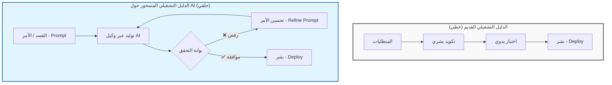

# مقدمة: لماذا يحتاج تطوير البرمجيات إلى دليل تشغيلي (Playbook) جديد

### 🎯 أهداف التعلم
بحلول نهاية هذا الفصل، سوف تستوعب:
*   لماذا تنهار نماذج تطوير البرمجيات التقليدية (Agile/DevOps) تحت وطأة سرعة الذكاء الاصطناعي.
*   التحول الجوهري من دور "كاتب الكود" (Code Writer) إلى "منسق الذكاء الاصطناعي" (AI Orchestrator).
*   المقايضات والمخاطر الخفية لتبني تدفقات العمل المتمحورة حول الذكاء الاصطناعي (AI-native workflows)، وتحديداً التوتر القائم بين السرعة والفهم العميق.
*   هيكلية هذا الكتاب وكيفية استخدامه كدليل تكتيكي.

---

يشهد مجال هندسة البرمجيات تحولاً زلزالياً. لعقود من الزمن، تطورت الممارسات الأساسية لبناء البرمجيات—التخطيط، التكويد، الاختبار، النشر—بشكل تدريجي. حلت منهجية "أجايل" (Agile) محل "الشلال" (Waterfall). وقامت "ديف أوبس" (DevOps) بردم الهوة بين الصوامع التشغيلية والتطويرية. وأعادت الحوسبة السحابية تعريف البنية التحتية. ولكن الآن، تعيد قوة جديدة تشكيل المشهد بأكمله: **الذكاء الاصطناعي (Artificial Intelligence)**.

لم يعد الذكاء الاصطناعي مجرد إضافة مستقبلية أو أداة متخصصة لعلماء البيانات. بل أصبح **متعاوناً من الدرجة الأولى** (First-class collaborator) في عملية تطوير البرمجيات. بدءاً من توليد الكود وكتابة اختبارات الوحدات (Unit Tests)، وصولاً إلى تصميم المعماريات البرمجية وأتمتة عمليات النشر، تتدخل وكلاء الذكاء الاصطناعي (AI Agents) في أدوار كانت تقليدياً حكراً على المطورين البشر. هذا ليس مجرد أتمتة (Automation)—إنه تعزيز للقدرات (Augmentation). وهذا يتطلب طريقة تفكير جديدة كلياً.

### 📊 تصور التحول

تتغير الحلقة الأساسية لإنشاء البرمجيات. نحن ننتقل من عملية خطية يدوية إلى تدفق عمل حلقي يرتكز على التحقق (Validation-centric).

### الدليل التشغيلي القديم ينهار

بُني دليل تطوير البرمجيات التقليدي لعالم يكتب فيه البشر كل سطر من الكود، ويتخذون كل قرار، ويتحملون العبء المعرفي (Cognitive Load) الكامل للتعقيد البرمجي. في ذلك العالم:

-   كانت **المتطلبات** تُترجم يدوياً إلى قصص مستخدم (User Stories).
-   قام **المطورون** بكتابة الكود النمطي (Boilerplate code) من الصفر.
-   كانت **تغطية الاختبار** (Test coverage) غالباً ما تأتي كفكرة لاحقة بسبب ضيق الوقت.
-   كان **التوثيق** (Documentation) يتخلف بشكل دائم عن التنفيذ.
-   كانت **خطوط أنابيب النشر** (Deployment pipelines) تُبنى يدوياً وتتسم بالهشاشة.

هذا النموذج غير قابل للتوسع (Does not scale) في عالم يستطيع فيه الذكاء الاصطناعي توليد الكود واختباره ونشره في ثوانٍ. والأسوأ من ذلك، أنه يهدر القيمة من خلال الفشل في الاستفادة من الإمكانات الكاملة للأنظمة الذكية. التمسك بالدليل القديم اليوم يشبه محاولة بناء ناطحة سحاب بمطرقة ومسامير بينما تتوفر لديك رافعة عملاقة.

### صعود المطور المعزز بالذكاء الاصطناعي

مطوروا اليوم لم يعودوا مجرد مبرمجين—بل هم **منسقون للذكاء** (Orchestrators of intelligence). يقومون بصياغة الأوامر (Prompting)، وتوجيه، والتحقق من وكلاء الذكاء الاصطناعي. يصممون تدفقات عمل يتعاون فيها البشر والآلات. يبنون أنظمة تتعلم وتتكيّف وتتحسن بمرور الوقت.

يقدم هذا النموذج الجديد تحديات جديدة:

-   كيف تكتب أوامر (Prompts) تنتج كوداً موثوقاً وآمناً؟
-   كيف تقيم المخرجات المولدة بواسطة الذكاء الاصطناعي من حيث الصحة والامتثال (Compliance)؟
-   كيف تدير المعرفة، والسياق (Context)، والتغذية الراجعة عبر وكلاء متعددين؟
-   كيف تحكم استخدام الذكاء الاصطناعي بشكل أخلاقي وشفاف؟

هذه ليست أسئلة يمكن للدليل التشغيلي القديم الإجابة عليها.

### ⚖️ المقايضة: الكود مقابل الإدراك (Code vs. Cognition)

بينما يوفر الذكاء الاصطناعي سرعة هائلة، فإنه يقدم مجموعة جديدة من المخاطر التي سيساعدك هذا الكتاب على تجاوزها. من الضروري أن تفهم أن **الذكاء الاصطناعي ليس غداءً مجانياً**:

1.  **فقدان الذاكرة العضلية (Muscle Memory):** مع كتابة الذكاء الاصطناعي للمزيد من الكود النمطي، يخاطر المطورون بفقدان الفهم العميق لكيفية عمل أنظمتهم "تحت الغطاء". إذا توقفت عن كتابة استعلامات SQL، فقد تنسى في النهاية كيفية تحسين أدائها.
2.  **عبء المراجعة:** ينتقل عنق الزجاجة من *كتابة* الكود إلى *مراجعة* الكود. غالباً ما يكون تصحيح (Debug) الكود المولد بواسطة الذكاء الاصطناعي أصعب من كتابته بنفسك، مما يؤدي إلى "إرهاق المراجعة" (Review Fatigue).
3.  **وهم الكفاءة:** يمكن للذكاء الاصطناعي توليد كود غير صحيح أو غير آمن بثقة تامة. بدون إطار عمل منضبط للتحقق (Validation framework)، تخاطر الفرق بشحن الأخطاء البرمجية (Bugs) أسرع من أي وقت مضى.

أن تصبح مطوراً أصيلاً في الذكاء الاصطناعي (AI-native developer) يعني قبول هذه المقايضات وبناء أنظمة (مثل خطوط أنابيب التحقق المؤتمتة) للتخفيف منها.

### دليل تشغيلي جديد لحقبة جديدة

هذا الكتاب عبارة عن مجموعة من **الأدلة المفقودة**—أطر عمل عملية، تكتيكية، واستشرافية للعمل مع الذكاء الاصطناعي في تطوير البرمجيات. الأمر لا يتعلق باستبدال المطورين. بل يتعلق **بتمكينهم** للبناء بشكل أسرع، وأكثر ذكاءً، وأكثر مسؤولية.

ستتعلم كيفية:

-   **استخدام وكلاء الذكاء الاصطناعي** عبر دورة حياة البرمجيات (الفصل 2).
-   **هندسة الأوامر والسياق** للحصول على مخرجات عالية الجودة (الفصلين 3 و 4).
-   **التحقق، والتكرار، وحوكمة** العناصر (Artifacts) المولدة بواسطة الذكاء الاصطناعي (الفصول 5، 6، و 8).
-   **التعاون مع وكلاء متعددين** كفريق تطوير افتراضي (الفصل 9).
-   **قياس العائد على الاستثمار (ROI)** وتجهيز تدفقات عملك للمستقبل (الفصلين 10 و 11).

سواء كنت مطوراً مستقلاً، أو قائداً تقنياً (Tech Lead)، أو مديراً تقنياً (CTO)، سيساعدك هذا الكتاب على تجاوز التحول من التطوير التقليدي إلى **الهندسة المتمحورة حول الذكاء الاصطناعي** (AI-native engineering).

مستقبل البرمجيات لا يتعلق فقط بكتابة الكود. إنه يتعلق بتصميم أنظمة تفكر، وتتعلم، وتتطور. وهذا المستقبل يبدأ الآن.

### 📝 ملخص والخطوات التالية

**النقاط الرئيسية:**
*   **التحول:** نحن ننتقل من التكويد اليدوي إلى تنسيق الوكلاء الأذكياء.
*   **الفجوة:** تفتقر ممارسات Agile/DevOps التقليدية إلى أطر العمل الخاصة بهندسة الأوامر، وإدارة السياق، وحوكمة الذكاء الاصطناعي.
*   **المخاطرة:** ينتقل التحدي الأساسي من توليد النحو البرمجي (Syntax generation) إلى التحقق وتصميم النظام.
*   **الهدف:** يوفر هذا الكتاب الأطر التكتيكية ("الأدلة المفقودة") لسد هذه الفجوة.

**القادم تالياً:**
في **الفصل 02**، سنقوم برسم خريطة تحدد بالضبط *أين* يتناسب وكلاء الذكاء الاصطناعي مع تدفق عملك اليومي، متجاوزين واجهات الدردشة البسيطة إلى أدوار متخصصة مثل "مهندس الاختبار" و"وكيل ديف أوبس".
