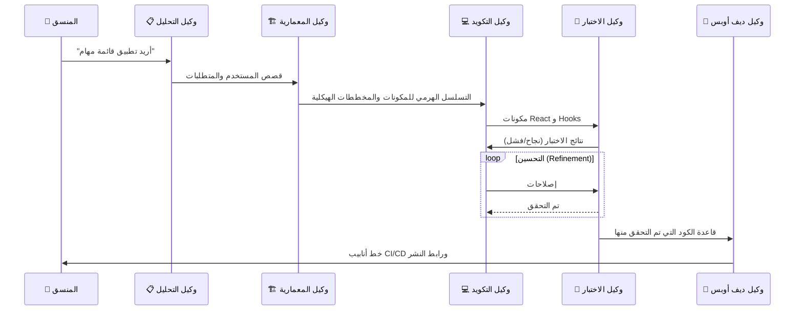

# 🧭 الدليل المفقود لاستخدام وكلاء الذكاء الاصطناعي في تطوير البرمجيات

### 🎯 أهداف التعلم
بحلول نهاية هذا الفصل، ستكون قادراً على:
*   تحديد نقاط دخول (Entry points) محددة لوكلاء الذكاء الاصطناعي عبر كامل دورة حياة تطوير البرمجيات (SDLC).
*   تعريف أدوار متميزة لوكلاء الذكاء الاصطناعي (مثل: المبرمج، المختبر، المحلل) للتعامل معهم كزملاء فريق متخصصين.
*   دمج الوكلاء في تدفقات العمل الحالية لديك (IDE، CI/CD، ChatOps).
*   إدراك المقايضات والمخاطر المحددة المرتبطة باستقلالية الوكيل، مثل الهلوسة (Hallucination) ومتلازمة "يبدو جيداً لي" (LGTM Syndrome).

---

## 1. 📌 أين يتناسب وكلاء الذكاء الاصطناعي في دورة حياة التطوير

يمكن تضمين وكلاء الذكاء الاصطناعي عبر **خط أنابيب تطوير البرمجيات بالكامل**. هم ليسوا مقيدين بكتابة الكود فقط؛ بل يمكنهم المساعدة في الاستدلال (Reasoning)، والتخطيط، والتحقق.

-   **التخطيط والمتطلبات (Planning & Requirements)**
    -   توليد قصص المستخدم (User Stories) من أفكار المنتجات الغامضة.
    -   اقتراح معماريات تقنية بناءً على القيود المفروضة.
    -   تحديد الحالات الحدية (Edge cases) والمخاطر مبكراً.
-   **التصميم (Design)**
    -   إنشاء المخططات الهيكلية (Wireframes) أو النماذج الأولية لواجهة/تجربة المستخدم (UI/UX).
    -   التوصية بأنماط التصميم (MVC، Microservices، إلخ).
    -   توليد مواصفات واجهة برمجة التطبيقات (API Specifications) من اللغة الطبيعية.
-   **التكويد (Coding)**
    -   الإكمال التلقائي للكود النمطي (Boilerplate code).
    -   توليد اختبارات الوحدات (Unit tests) جنباً إلى جنب مع الدوال البرمجية.
    -   اقتراح إعادة هيكلة الكود (Refactoring) لتحسين المقروئية والأداء.
-   **الاختبار (Testing)**
    -   إنشاء بيانات اختبار اصطناعية (Synthetic test data).
    -   أتمتة نصوص اختبار الانحدار (Regression testing scripts).
    -   اكتشاف الاختبارات غير المستقرة (Flaky tests) أو فجوات التغطية.
-   **النشر (Deployment)**
    -   توليد تكوينات خط أنابيب التكامل المستمر/النشر المستمر (CI/CD).
    -   اقتراح استراتيجيات الحاويات (Docker/Kubernetes).
    -   مراقبة السجلات (Logs) ووضع علامات على الحالات الشاذة.
-   **الصيانة (Maintenance)**
    -   تلخيص تقارير الأخطاء (Bug reports).
    -   التوصية بالتصحيحات (Patches) أو تحديثات الاعتماديات (Dependency updates).
    -   أتمتة تحديثات التوثيق.

---

## 2. ⚙️ أدوار وكيل الذكاء الاصطناعي العملية

فكر في وكلاء الذكاء الاصطناعي كـ **زملاء فريق متخصصين** بدلاً من روبوت دردشة عام واحد. يساعد تعيين شخصيات اعتبارية (Personas) محددة في تضييق السياق وتحسين جودة المخرجات.

| الدور | ما يفعلونه | أمثلة على الأدوات |
| :--- | :--- | :--- |
| **مساعد الكود (Code Assistant)** | يكتب، يراجع، ويعيد هيكلة الكود | GitHub Copilot, Tabnine, Cursor |
| **مهندس الاختبار (Test Engineer)** | يولد اختبارات الوحدات/التكامل | CodiumAI, TestGPT |
| **وكيل ديف أوبس (DevOps Agent)** | يؤتمت CI/CD، يراقب البنية التحتية | Jenkins AI plugins, Kubiya |
| **وكيل التوثيق (Documentation Agent)** | يبقي الوثائق متزامنة مع الكود | Mintlify, Swimm |
| **محلل المشروع (Project Analyst)** | يترجم المتطلبات إلى مهام | Jira AI, Linear AI |

---

## 3. 🚀 تكامل تدفق العمل

إليك كيفية **توصيل وكلاء الذكاء الاصطناعي بتدفق التطوير اليومي** ليصبحوا مضاعفات للقوة (Force multipliers) بشكل سلس:

-   **تكامل بيئة التطوير (IDE Integration)** ← إكمال تلقائي، شروحات مضمنة (Inline)، وتوليد فوري للاختبارات مباشرة داخل VS Code أو JetBrains.
-   **عمليات الدردشة (ChatOps)** ← وكلاء ذكاء اصطناعي داخل Slack/Teams للأسئلة والأجوبة السريعة، ومشغلات النشر (Deployment triggers)، وتلخيص الحوادث.
-   **خطوط أنابيب CI/CD** ← وكلاء يقومون بمراجعة طلبات السحب (PRs)، وتشغيل الاختبارات، واقتراح الإصلاحات قبل أن يرى الإنسان الكود.
-   **المراقبة والتنبيهات** ← يقوم الذكاء الاصطناعي بتصفية السجلات، وتقليل الضوضاء، وتسليط الضوء على المشكلات الحقيقية من خلال ربط الأحداث عبر الخدمات.

---

## 4. ⚖️ تكلفة الاستقلالية: المقايضات والمخاطر

بينما يزيد وكلاء الذكاء الاصطناعي من السرعة (Velocity)، فإنهم يقدمون مخاطر محددة يجب إدارتها. **الاستقلالية لا تعني انعدام الإشراف.**

1.  **هلوسة السياق (Context Hallucination):** قد يشير الوكلاء بثقة إلى ملفات، أو دوال، أو مكتبات غير موجودة.
    *   *التخفيف:* تحقق دائماً من الاستيرادات (Imports) والمراجع الخارجية.
2.  **متلازمة "يبدو جيداً لي" (LGTM Syndrome):** قد يعتاد المطورون على دمج طلبات السحب (PRs) المولدة بواسطة الذكاء الاصطناعي دون قراءتها ("Looks Good To Me")، مما يؤدي إلى إدخال أخطاء منطقية دقيقة.
    *   *التخفيف:* فرض معايير صارمة لمراجعة الكود، بغض النظر عن المؤلف (بشري أو ذكاء اصطناعي).
3.  **النقاط العمياء الأمنية:** قد يقترح الوكلاء المدربون على كود عام أنماطاً غير آمنة أو اعتماديات قديمة.
    *   *التخفيف:* إقران وكلاء الذكاء الاصطناعي بأدوات التحليل الساكن (SAST) وماسحات الاعتماديات.
4.  **التكلفة والكمون (Cost & Latency):** يمكن أن تكون حلقات الوكيل متعددة الخطوات (استدلال ← تكويد ← اختبار) باهظة الثمن (تكاليف الرموز/Tokens) وبطيئة مقارنة بالتكويد اليدوي للمهام البسيطة.
    *   *التخفيف:* استخدم الوكلاء للمهام المعقدة أو المتكررة، وليس للتعديلات التافهة.

---

## 5. 🛡️ أفضل الممارسات

-   **الإنسان في الحلقة (Human-in-the-loop):** راجع دائماً الكود المولد بواسطة الذكاء الاصطناعي قبل الدمج. تعامل مع الذكاء الاصطناعي كمطور مبتدئ (Junior Developer).
-   **تغذية السياق (Context feeding):** امنح الوكلاء وثائق خاصة بالمشروع، وأدلة الأنماط (Style guides)، وملاحظات المعمارية. الوكيل جيد بقدر السياق الذي يمتلكه فقط.
-   **الفحوصات الأمنية:** قم بتشغيل التحليل الساكن على مخرجات الذكاء الاصطناعي لتجنب الثغرات الأمنية.
-   **انضباط التحكم في الإصدار:** تعامل مع اقتراحات الذكاء الاصطناعي مثل الالتزامات (Commits) — راجعها، واختبرها، ووثقها بشكل صحيح.

---

## 6. 🧩 مثال لتدفق العمل: تتابع الوكلاء (Agent Relay)

تخيل أنك تبني **تطبيق React**. بدلاً من القيام بكل شيء بنفسك، تقوم بتنسيق سباق تتابع بين وكلاء متخصصين.

### تصور التسليم (Handoff)

### الخطوات بالتفصيل

1.  **المتطلبات**: يقوم وكيل **محلل المشروع** بتحويل الأمر (Prompt) الغامض إلى تراكم (Backlog) لقصص المستخدم.
2.  **التصميم**: يقوم وكيل **المعمارية** بتوليد المخططات الهيكلية واقتراح تسلسل هرمي للمكونات.
3.  **التكويد**: يقوم **مساعد الكود** بالإكمال التلقائي لخطافات React (Hooks) وتوليد استدعاءات API بناءً على التصميم.
4.  **الاختبار**: يقوم **مهندس الاختبار** بإنشاء اختبارات وحدة Jest لكل مكون فور توليده.
5.  **النشر**: يقترح **وكيل ديف أوبس** تدفق عمل GitHub Actions لـ CI/CD.
6.  **الصيانة**: يقوم **وكيل الدعم** بتلخيص تقارير الأخطاء واقتراح الإصلاحات.

---

## 7. 🔮 الاتجاه المستقبلي

-   **التعاون متعدد الوكلاء:** وكلاء ذكاء اصطناعي مختلفون (مخطط، مبرمج، مختبر) يعملون معاً في سرب (Swarm) لحل المشكلات المعقدة دون تدخل بشري بين الخطوات.
-   **أنظمة المعالجة الذاتية (Self-healing systems):** وكلاء يكتشفون أخطاء الإنتاج، ويكتبون إصلاحاً، ويختبرونه، وينشرونه بشكل مستقل.
-   **وكلاء محددون للمجال (Domain-specific):** نماذج مضبوطة بدقة عالية ومصممة لصناعات محددة مثل التكنولوجيا المالية، أو الرعاية الصحية، أو الألعاب.

---

### 📝 ملخص والخطوات التالية

**النقاط الرئيسية:**
*   وكلاء الذكاء الاصطناعي ليسوا مجرد مولدات للكود؛ فهم يتناسبون مع التخطيط، والاختبار، والعمليات (Ops).
*   يؤدي تعيين أدوار محددة (مثل "مهندس اختبار") إلى تحسين أداء الوكيل عن طريق تضييق السياق.
*   يجب عليك الموازنة بين سرعة الاستقلالية ومخاطر الهلوسة والثغرات الأمنية.

**القادم تالياً:**
الآن بعد أن عرفت *من* هم الوكلاء و *أين* يتناسبون، تحتاج إلى تعلم كيفية التحدث معهم بفعالية. **الفصل 03: الدليل المفقود لهندسة الأوامر** سيعلمك لغة تنسيق الذكاء الاصطناعي.
