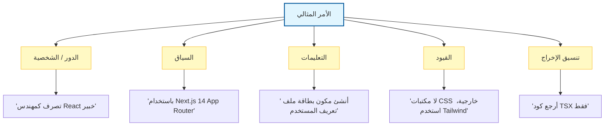

# 🧭 الدليل المفقود لهندسة الأوامر (Prompt Engineering) في تطوير البرمجيات

### 🎯 أهداف التعلم
بحلول نهاية هذا الفصل، ستكون قادراً على:
*   التعامل مع هندسة الأوامر (Prompt Engineering) كنظام تقني، وليس مجرد "سؤال الذكاء الاصطناعي".
*   تطبيق أنماط الأوامر الجوهرية (التعليمية، قليلة اللقطات/Few-Shot، سلسلة الأفكار/Chain-of-Thought) على مهام تطوير محددة.
*   تحديد المقايضات (Trade-offs) بين تعقيد الأمر، وتكلفة الرموز (Token cost)، والكمون (Latency).
*   تخفيف المخاطر المتعلقة باللاحتمية (Non-determinism) وتحديثات النماذج ("انحراف الأمر" أو Prompt Drift).

---

## 1. 🎯 لماذا تهم هندسة الأوامر

هندسة الأوامر هي فن **تصميم المدخلات** للحصول على أكثر المخرجات فائدة من الذكاء الاصطناعي. في تطوير البرمجيات، لا يتعلق الأمر فقط بطلب كود—بل يتعلق **بتوجيه الذكاء الاصطناعي** ليتصرف كزميل في الفريق يفهم السياق، والقيود، والأهداف.

الأمر الغامض ينتج كوداً عاماً وغالباً ما يكون مليئاً بالأخطاء (Buggy). أما الأمر المهيكل والمصمم هندسياً فينتج منطقاً جاهزاً للإنتاج (Production-ready). فكر في الأمر (Prompt) باعتباره **توقيع الدالة (Function Signature)** لذكاء النموذج.

### 📊 تصور تشريح الأمر المثالي

للحصول على نتائج متسقة، قم بهيكلة أوامرك مثل طلب واجهة برمجة تطبيقات (API Request) جيد الصياغة.

---

## 2. 🛠️ المبادئ الجوهرية

-   **كن محدداً (Be Specific)** ← "ولد مكون React مع شريط بحث وتقنية debounce" أفضل من "اصنع شريط بحث".
-   **وفر السياق (Provide Context)** ← قم بتضمين أطر العمل، المكتبات، نمط التكويد (Coding style)، أو قيود المشروع.
-   **حدد الدور/الشخصية (Set Role/Persona)** ← "تصرف كمهندس واجهة خلفية خبير (Senior Backend Engineer)" يغير جودة وعمق الاقتراحات.
-   **كرر المحاولة (Iterate)** ← حسن الأوامر بناءً على المخرجات؛ تعامل مع الأمر مثل تصحيح أخطاء (Debugging) تعليماتك.
-   **سلسل الأوامر (Chain Prompts)** ← قسم المهام المعقدة إلى خطوات أصغر (تصميم ← تكويد ← اختبار ← توثيق) بدلاً من طلب كل شيء دفعة واحدة.

---

## 3. 📌 حالات الاستخدام عبر دورة حياة التطوير

| المرحلة | مثال على هندسة الأوامر |
| :--- | :--- |
| **التخطيط** | "ولد 5 قصص مستخدم (User Stories) لتطبيق مهام، كل منها مع معايير القبول (Acceptance Criteria)." |
| **التصميم** | "اقترح معمارية خدمات مصغرة (Microservice Architecture) لتطبيق تجارة إلكترونية مع وحدات للدفع، والمخزون، والمستخدمين." |
| **التكويد** | "اكتب دالة Python لتحليل سجلات JSON، متبعاً نمط PEP8، مع معالجة الأخطاء." |
| **الاختبار** | "أنشئ اختبارات وحدة Jest لمكون React يقوم بعرض قائمة من المهام." |
| **التصحيح (Debugging)** | "اشرح سبب بطء استعلام SQL هذا واقترح تحسينات." |
| **التوثيق** | "ولد وثائق API لنقاط النهاية (Endpoints) هذه بتنسيق Markdown." |
| **ديف أوبس (DevOps)** | "اكتب ملف GitHub Actions YAML لـ CI/CD يقوم بتشغيل الاختبارات والنشر على GitHub Pages." |

---

## 4. 🧩 أنماط الأوامر التي يجب أن تتقنها

-   **الأوامر التعليمية (Instructional Prompts)** ← "اشرح خطوة بخطوة كيفية..."
-   **أوامر توليد الكود (Code Generation Prompts)** ← "اكتب دالة بلغة Go تقوم بـ..."
-   **أوامر إعادة الهيكلة (Refactoring Prompts)** ← "أعد كتابة هذه الدالة لتحسين المقروئية وتقليل التعقيد."
-   **أوامر الاختبار (Testing Prompts)** ← "ولد اختبارات الحالات الحدية (Edge case tests) لهذه الخوارزمية."
-   **أوامر الشرح (Explainer Prompts)** ← "لخص ما يفعله هذا الكود بلغة إنجليزية بسيطة."

---

## 5. 🚀 تقنيات متقدمة

للحصول على مخرجات بمستوى خبير (Senior-level)، تحتاج إلى تقنيات متقدمة:

-   **هندسة الأوامر قليلة اللقطات (Few-shot prompting)** ← توفير أمثلة للمخرجات المطلوبة (أزواج مدخلات -> مخرجات) بحيث يحاكي الذكاء الاصطناعي النمط والتنسيق. هذه هي الطريقة الأكثر فعالية لفرض معايير التكويد.
-   **سلسلة الأفكار (Chain-of-thought - CoT)** ← اطلب من الذكاء الاصطناعي أن "يفكر خطوة بخطوة" قبل إعطاء الإجابة النهائية.
    *   *ملاحظة:* بينما تحسن CoT المنطق للخوارزميات المعقدة، فإنها تزيد من استهلاك الرموز (Tokens) والكمون (Latency). بالنسبة للتطبيقات التي تواجه المستخدم، فكر في إخفاء خطوات "الاستدلال" وعرض النتيجة النهائية فقط لتجنب كشف المنطق الداخلي الخام.
-   **الأوامر القائمة على القيود (Constraint-based prompting)** ← "ولد كوداً أقل من 30 سطراً، بدون مكتبات خارجية."
-   **التحسين متعدد الأدوار (Multi-turn refinement)** ← ابدأ بشكل واسع، ثم ضيق النطاق باستخدام أوامر المتابعة.

---

## 6. ⚖️ هشاشة الأوامر: المقايضات والمخاطر

هندسة الأوامر ليست حلاً سحرياً (Silver bullet). إنها تأتي مع عدم استقرار متأصل يجب على المطورين إدارته:

1.  **اللاحتمية (Non-Determinism):** قد ينتج نفس الأمر كوداً مختلفاً في تشغيلات مختلفة.
    *   *التخفيف:* اضبط معامل `temperature` على 0 لمهام توليد الكود لتعظيم الاتساق.
2.  **انحراف الأمر (Prompt Drift):** الأمر الذي يعمل بشكل مثالي على GPT-4 قد يفشل على GPT-4o أو Claude 3.5. تحديثات النماذج يمكن أن تكسر "الكود" الخاص بك.
    *   *التخفيف:* تعامل مع الأوامر مثل الكود. قم بإصدار نسخ منها (Versioning) واختبرها مقابل خط أساس عند تحديث النماذج.
3.  **تكلفة الرموز مقابل الجودة:** تستهلك الأوامر المفصلة (خاصة Few-Shot و Chain-of-Thought) المزيد من الرموز، مما يزيد التكلفة والكمون.
    *   *التخفيف:* قم بتحسين الأوامر للاختصار بمجرد إثبات صحة المنطق.
4.  **حقن الأوامر (Prompt Injection):** إذا قمت بتضمين مدخلات المستخدم مباشرة في الأمر، فقد يقوم المستخدمون الخبيثون بتجاوز تعليماتك.
    *   *التخفيف:* قم بتعقيم المدخلات (Sanitize inputs) واستخدم رسائل "النظام" (System messages) لفصل التعليمات عن البيانات.

---

## 7. 🛡️ أفضل الممارسات

-   **راجع دائماً الكود المولد بواسطة الذكاء الاصطناعي** قبل الدمج.
-   **استخدم أدلة الأنماط (Style guides)** في الأوامر (مثال: "اتبع دليل نمط Airbnb JavaScript").
-   **إقران الأوامر بأدوات التحليل الساكن** للسلامة/الأمان.
-   **تعامل مع الأوامر مثل التوثيق** — قابلة لإعادة الاستخدام والمشاركة عبر الفريق.

---

## 8. 🔮 الاتجاه المستقبلي

-   **مكتبات الأوامر القابلة لإعادة الاستخدام** ← ستحافظ الفرق على قوالب الأوامر مثل مقتطفات الكود (Code snippets).
-   **إصدار نسخ الأوامر (Prompt versioning)** ← تتبع التغييرات في الأوامر جنباً إلى جنب مع الكود.
-   **تنسيق الوكلاء المتعددين (Multi-agent orchestration)** ← أوامر مختلفة لوكلاء التخطيط، والتكويد، والاختبار الذين يعملون معاً.

---

### 📝 ملخص والخطوات التالية

**النقاط الرئيسية:**
*   الأوامر هي الواجهة لذكاء النموذج؛ التحديد هو المفتاح.
*   استخدم **Few-Shot** لفرض النمط و **Chain-of-Thought** للمنطق المعقد.
*   كن على دراية بـ **انحراف الأمر (Prompt Drift)** و **اللاحتمية (Non-Determinism)**—تتطلب الأوامر صيانة تماماً مثل الكود.

**القادم تالياً:**
الأمر العظيم عديم الفائدة بدون المعلومات الصحيحة. في **الفصل 04: الدليل المفقود لهندسة السياق**، سنتعلم كيفية تغذية الذكاء الاصطناعي بالملفات، والوثائق، والبيانات الوصفية (Metadata) الصحيحة لمنع الهلوسات.
