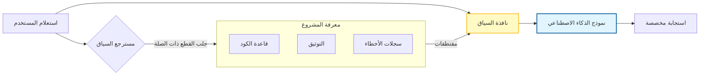

# 🧭 الدليل المفقود لهندسة السياق (Context Engineering) في تطوير البرمجيات

### 🎯 أهداف التعلم
بحلول نهاية هذا الفصل، ستكون قادراً على:
*   التمييز بين *هندسة الأوامر* (التعليمات) و *هندسة السياق* (استرجاع المعلومات).
*   تطبيق تقنيات مثل **التقطيع (Chunking)** و **حقن البيانات الوصفية (Metadata Injection)** لتحسين ملاءمة الذكاء الاصطناعي.
*   تنفيذ أنماط سياق محددة، بما في ذلك **معالجة الأخطاء الواعية بالسياق**، لتصحيح المشكلات المعقدة.
*   إدارة المقايضات (Trade-offs) بين عمق السياق، وتكلفة الرموز (Token cost)، وظاهرة "الضياع في المنتصف" (Lost in the Middle).

---

## 1. 🎯 ما هي هندسة السياق؟

هندسة السياق هي التصميم المتعمد **لما تغذيه في نظام الذكاء الاصطناعي** من معلومات (مقتطفات برمجية، توثيق، متطلبات، قيود، سجل تاريخي) بحيث تكون مخرجاته **ذات صلة، دقيقة، ومتوافقة مع أهدافك**.

بينما تتعلق هندسة الأوامر (Prompt Engineering) بـ *كيفية الطلب*، فإن هندسة السياق تتعلق بـ *ما يعرفه الذكاء الاصطناعي* عندما يجيب. فكر في الأمر على أنه **تهيئة المسرح (Setting the stage)**: كلما كان السياق أفضل، كان زميلك الذكي (AI teammate) أكثر ذكاءً.

### 📊 تصور حقن السياق (RAG)

تستخدم معظم تدفقات عمل الذكاء الاصطناعي المتقدمة نمطاً يسمى **التوليد المعزز بالاسترجاع (Retrieval Augmented Generation - RAG)**. بدلاً من لصق قاعدة الكود (Codebase) بالكامل في نافذة الدردشة، تقوم بجلب ما هو مطلوب فقط ديناميكياً.

---

## 2. 📌 لماذا يهم ذلك في تطوير البرمجيات

-   **الدقة (Precision)** ← تجنب المخرجات الغامضة أو العامة من خلال ربط الذكاء الاصطناعي بقاعدة الكود الخاصة بك (Grounding).
-   **الاتساق (Consistency)** ← يبقي الذكاء الاصطناعي متوافقاً مع معايير التكويد الخاصة بفريقك واتفاقيات المشروع.
-   **الكفاءة (Efficiency)** ← يقلل من الأخذ والرد (Back-and-forth) من خلال إعطاء الذكاء الاصطناعي جميع الاعتماديات (Dependencies) اللازمة مقدماً.
-   **قابلية التوسع (Scalability)** ← تمكن تدفقات العمل القابلة لإعادة الاستخدام حيث يمكن للوكلاء تأهيل أنفسهم (Onboard themselves) على أجزاء جديدة من قاعدة الكود.

---

## 3. ⚙️ أين تتناسب هندسة السياق في دورة حياة التطوير

| المرحلة | السياق الذي تقدمه | مثال |
| :--- | :--- | :--- |
| **التخطيط** | رؤية المنتج، قصص المستخدم، القيود | "نحن نبني تطبيق مهام (Todo app) مع أولوية للجوال (Mobile-first)، يجب أن يدعم وضع عدم الاتصال." |
| **التصميم** | مخططات المعمارية، أدلة الأنماط | "استخدم الخدمات المصغرة (Microservices)، و REST APIs، واتبع دليل نمط Airbnb JS." |
| **التكويد** | مقتطفات من قاعدة الكود، إصدارات أطر العمل | "إليك مكون React الحالي لدينا. قم بتوسيعه لإضافة وظيفة البحث." |
| **الاختبار** | تقارير تغطية الاختبار، الحالات الحدية | "ولد اختبارات وحدة لهذه الدالة، ركز على المدخلات الفارغة (Null inputs) ومجموعات البيانات الكبيرة." |
| **التصحيح (Debugging)** | سجلات الأخطاء، تتبعات المكدس (Stack traces)، الالتزامات الأخيرة (Commits) | "بناءً على تتبع المكدس هذا وآخر 3 التزامات (Commits)، اقترح الأسباب المحتملة." |
| **النشر** | تكوينات CI/CD، تفاصيل البنية التحتية | "نحن ننشر عبر GitHub Actions إلى GitHub Pages، باستخدام Node.js 18." |
| **الصيانة** | سجلات التغيير (Changelogs)، قوائم الاعتماديات | "اقترح تحديثات لحزم npm هذه، مع تجنب التغييرات الكاسرة (Breaking changes)." |

---

## 4. 🧩 تقنيات لهندسة سياق فعالة

-   **التقطيع (Chunking)** ← قسم المدخلات الكبيرة (وثائق، كود) إلى قطع أصغر قابلة للهضم. لا تغذِ الملف بالكامل إذا كانت دالة واحدة فقط هي المهمة.
-   **تأطير الدور (Role framing)** ← "تصرف كمهندس DevOps خبير يراجع خط الأنابيب هذا." هذا يحدد السياق *الضمني* للخبرة.
-   **تضمين القيود (Constraint embedding)** ← "يجب أن يكون الإخراج أقل من 50 سطراً، بدون مكتبات خارجية."
-   **إرساء التاريخ (History anchoring)** ← قم بتضمين المحادثة السابقة أو تاريخ الكود حتى لا يفقد الذكاء الاصطناعي مسار المهمة الحالية.
-   **حقن البيانات الوصفية (Metadata injection)** ← أضف وسوماً (Tags) مثل `#frontend`، `#security`، أو مسارات الملفات لتوجيه تركيز الذكاء الاصطناعي.

---

## 5. 🚀 أنماط عملية

-   **توسيع الكود (Code Extension)**: توفير الكود الحالي + طلب تعديلات.
    *   *السياق:* الملف المراد تعديله + دوال الخدمات المساعدة (Utility functions) ذات الصلة + تعريفات الأنواع (Types definitions).
-   **معالجة الأخطاء الواعية بالسياق**: توفير السجلات + الكود المصدري.
    *   *السياق:* تتبع المكدس الخام (Raw stack trace)، الملف المحدد الذي حدث فيه الخطأ، و **فروقات git الحديثة (Recent git diffs)** لرؤية ما تغير مؤخراً. هذا يسمح للذكاء الاصطناعي بربط الخطأ بتغييرات الكود الحديثة.
-   **الاختبار**: توفير الدالة + طلب اختبارات وحدة للحالات الحدية.
    *   *السياق:* منطق الدالة + توثيق إطار عمل الاختبار (مثل تكوين Jest).
-   **التوثيق**: توفير مواصفات API + طلب وثائق Markdown.
    *   *السياق:* مواصفات OpenAPI/Swagger الخام.
-   **ديف أوبس (DevOps)**: توفير تكوين YAML + طلب خط أنابيب CI/CD محسن.
    *   *السياق:* ملف تدفق العمل الحالي + تفاصيل هدف النشر (Deployment target).

---

## 6. ⚖️ موازنة السياق: المقايضات والمخاطر

المزيد من السياق ليس دائماً أفضل. يجب عليك الموازنة بين كثافة المعلومات وقيود النموذج:

1.  **ظاهرة "الضياع في المنتصف" (Lost in the Middle):** النماذج اللغوية الكبيرة (LLMs) رائعة في تذكر بداية ونهاية الأمر، لكنها غالباً ما تنسى التفاصيل المدفونة في منتصف نافذة سياق كبيرة.
    *   *التخفيف:* ضع التعليمات الأكثر أهمية (القيود) في نهاية الأمر تماماً.
2.  **تكاليف الرموز والكمون (Token Costs & Latency):** حشو آلاف الأسطر من الكود في السياق يزيد من تكاليف API ويبطئ أوقات الاستجابة بشكل كبير.
    *   *التخفيف:* استخدم "التوليد المعزز بالاسترجاع" (RAG) لجلب المقتطفات ذات الصلة فقط.
3.  **تسرب البيانات (Data Leakage):** إضافة "جميع متغيرات البيئة" أو "ملفات التكوين الكاملة" إلى السياق يمكن أن يكشف عن طريق الخطأ مفاتيح API أو معلومات التعريف الشخصية (PII) لمزود النموذج.
    *   *التخفيف:* قم بتعقيم السياق (Sanitize context) قبل الإرسال. لا ترسل أبداً ملفات `.env`.
4.  **الضجيج مقابل الإشارة (Noise vs. Signal):** السياق غير ذي الصلة يربك النموذج، مما يؤدي إلى الهلوسة.
    *   *التخفيف:* كن قاسياً في تشذيب السياق. إذا لم يكن الذكاء الاصطناعي بحاجة إليه، لا ترسله.

---

## 7. 🛡️ أفضل الممارسات

-   **الحد الأدنى ولكنه كافٍ**: لا تفرط في التحميل بتفاصيل غير ذات صلة.
-   **حافظ على حداثة السياق**: قم بتحديث الأوامر بأحدث الكود/الوثائق؛ السياق القديم (Stale context) يؤدي إلى أخطاء برمجية (Bugs).
-   **الأمان أولاً**: تجنب كشف الأسرار أو بيانات الاعتماد في السياق. استخدم عناصر نائبة (مثل `API_KEY=***`).
-   **قوالب قابلة لإعادة الاستخدام**: ابنِ أطر عمل للسياق للمهام الشائعة (التكويد، الاختبار، النشر).

---

## 8. 🔮 الاتجاه المستقبلي

-   **مكتبات السياق** ← ستحافظ الفرق على كتل سياق قابلة لإعادة الاستخدام (مثل مقتطفات الكود).
-   **نوافذ سياق ديناميكية** ← سيقوم وكلاء الذكاء الاصطناعي باختيار ملفات المشروع الأكثر صلة تلقائياً (Auto-RAG).
-   **مشاركة السياق متعددة الوكلاء** ← سيتبادل الوكلاء المختلفون (المبرمج، المختبر، الناشر) السياق بسلاسة دون نسخ ولصق بشري.

---

### 📝 ملخص والخطوات التالية

**النقاط الرئيسية:**
*   السياق هو الوقود لمحرك الذكاء الاصطناعي؛ ما يدخل قمامة، يخرج قمامة (Garbage in, garbage out).
*   استخدم **التقطيع (Chunking)** و **البيانات الوصفية (Metadata)** لهيكلة المعلومات للذكاء الاصطناعي.
*   احذر من **تسرب البيانات** وتأثير **"الضياع في المنتصف"**—قم بتنقيح سياقك بعناية.

**القادم تالياً:**
لديك الوكلاء، والأوامر، والسياق. ولكن كيف تعرف ما إذا كان الإخراج جيداً بالفعل؟ في **الفصل 05: الدليل المفقود للتقييم والتحقق**، سنقوم ببناء بوابات الجودة التي تحافظ على بيئة الإنتاج الخاصة بك آمنة.
