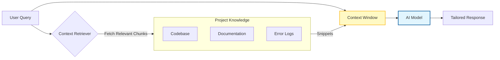

# 🧭 The Missing Guide to Context Engineering in Software Development

### 🎯 Learning Objectives
By the end of this chapter, you will be able to:
*   Distinguish between *Prompt Engineering* (instructions) and *Context Engineering* (information retrieval).
*   Apply techniques like **Chunking** and **Metadata Injection** to improve AI relevance.
*   Implement specific context patterns, including **Context-Aware Error Handling**, to debug complex issues.
*   Manage the trade-offs between context depth, token cost, and the "Lost in the Middle" phenomenon.

---

## 1. 🎯 What Is Context Engineering?

Context engineering is the deliberate design of **what information you feed into an AI system** (code snippets, documentation, requirements, constraints, history) so that its outputs are **relevant, accurate, and aligned with your goals**.

While Prompt Engineering is about *how you ask*, Context Engineering is about *what the AI knows* when it answers. Think of it as **setting the stage**: the better the context, the smarter the AI teammate.

### 📊 Visualizing Context Injection (RAG)

Most advanced AI workflows use a pattern called **Retrieval Augmented Generation (RAG)**. Instead of pasting your whole codebase into a chat window, you dynamically fetch only what is needed.

---

## 2. 📌 Why It Matters in Software Development

-   **Precision** → Avoids vague or generic outputs by grounding the AI in your specific codebase.
-   **Consistency** → Keeps AI aligned with your team's coding standards and project conventions.
-   **Efficiency** → Reduces back-and-forth by giving the AI all necessary dependencies upfront.
-   **Scalability** → Enables reusable workflows where agents can onboard themselves onto new parts of the codebase.

---

## 3. ⚙️ Where Context Engineering Fits in the Dev Lifecycle

| Stage | Context You Provide | Example |
| :--- | :--- | :--- |
| **Planning** | Product vision, user stories, constraints | “We’re building a todo app for mobile-first users, must support offline mode.” |
| **Design** | Architecture diagrams, style guides | “Use microservices, REST APIs, and follow Airbnb JS style guide.” |
| **Coding** | Codebase snippets, framework versions | “Here’s our existing React component. Extend it to add search functionality.” |
| **Testing** | Test coverage reports, edge cases | “Generate unit tests for this function, focus on null inputs and large datasets.” |
| **Debugging** | Error logs, stack traces, recent commits | “Given this stack trace and the last 3 commits, suggest likely causes.” |
| **Deployment** | CI/CD configs, infra details | “We deploy via GitHub Actions to GitHub Pages, Node.js 18.” |
| **Maintenance** | Changelogs, dependency lists | “Suggest updates for these npm packages, avoiding breaking changes.” |

---

## 4. 🧩 Techniques for Effective Context Engineering

-   **Chunking** → Break large inputs (docs, code) into smaller, digestible pieces. Don't feed the whole file if only one function matters.
-   **Role framing** → “Act as a senior DevOps engineer reviewing this pipeline.” This sets the *implicit* context of expertise.
-   **Constraint embedding** → “Output must be under 50 lines, no external libraries.”
-   **History anchoring** → Include prior conversation or code history so the AI doesn’t lose track of the current task.
-   **Metadata injection** → Add tags like `#frontend`, `#security`, or file paths to guide the AI's focus.

---

## 5. 🚀 Practical Patterns

-   **Code Extension**: Provide existing code + ask for modifications.
    *   *Context:* The file to be modified + related utility functions + types definitions.
-   **Context-Aware Error Handling**: Provide logs + source code.
    *   *Context:* The raw stack trace, the specific file where the error occurred, and **recent git diffs** to see what changed recently. This allows the AI to correlate the error with recent code changes.
-   **Testing**: Provide function + ask for edge-case unit tests.
    *   *Context:* The function logic + the testing framework documentation (e.g., Jest config).
-   **Documentation**: Provide API spec + ask for Markdown docs.
    *   *Context:* The raw OpenAPI/Swagger spec.
-   **DevOps**: Provide YAML config + ask for optimized CI/CD pipeline.
    *   *Context:* The existing workflow file + deployment target details.

---

## 6. ⚖️ The Context Balancing Act: Trade-offs & Risks

More context is not always better. You must balance information density against model limitations:

1.  **The "Lost in the Middle" Phenomenon:** LLMs are great at remembering the beginning and end of a prompt, but often forget details buried in the middle of a large context window.
    *   *Mitigation:* Put the most critical instructions (constraints) at the very end of the prompt.
2.  **Token Costs & Latency:** Stuffing thousands of lines of code into context increases API costs and slows down response times significantly.
    *   *Mitigation:* Use "Retrieval Augmented Generation" (RAG) to fetch only relevant snippets.
3.  **Data Leakage:** Adding "all environment variables" or "full config files" to context can accidentally expose API keys or PII to the model provider.
    *   *Mitigation:* Sanitize context before sending. Never send `.env` files.
4.  **Noise vs. Signal:** Irrelevant context confuses the model, leading to hallucinations.
    *   *Mitigation:* Be ruthless about pruning context. If the AI doesn't need it, don't send it.

---

## 7. 🛡️ Best Practices

-   **Minimal but sufficient**: Don’t overload with irrelevant details.
-   **Keep context fresh**: Update prompts with the latest code/docs; stale context leads to bugs.
-   **Security first**: Avoid exposing secrets or credentials in context. Use placeholders (e.g., `API_KEY=***`).
-   **Reusable templates**: Build context frameworks for common tasks (coding, testing, deployment).

---

## 8. 🔮 Future Direction

-   **Context libraries** → Teams will maintain reusable context blocks (like code snippets).
-   **Dynamic context windows** → AI agents will auto-select the most relevant project files (Auto-RAG).
-   **Multi-agent context sharing** → Different agents (coder, tester, deployer) will exchange context seamlessly without human copy-pasting.

---

### 📝 Summary & Next Steps

**Key Takeaways:**
*   Context is the fuel for the AI engine; garbage in, garbage out.
*   Use **Chunking** and **Metadata** to structure information for the AI.
*   Beware of **Data Leakage** and the **"Lost in the Middle"** effect—curate your context carefully.

**Coming Up Next:**
You have the agents, the prompts, and the context. But how do you know if the output is actually good? In **Chapter 05: The Missing Guide to Evaluation & Validation**, we will build the quality gates that keep your production environment safe.