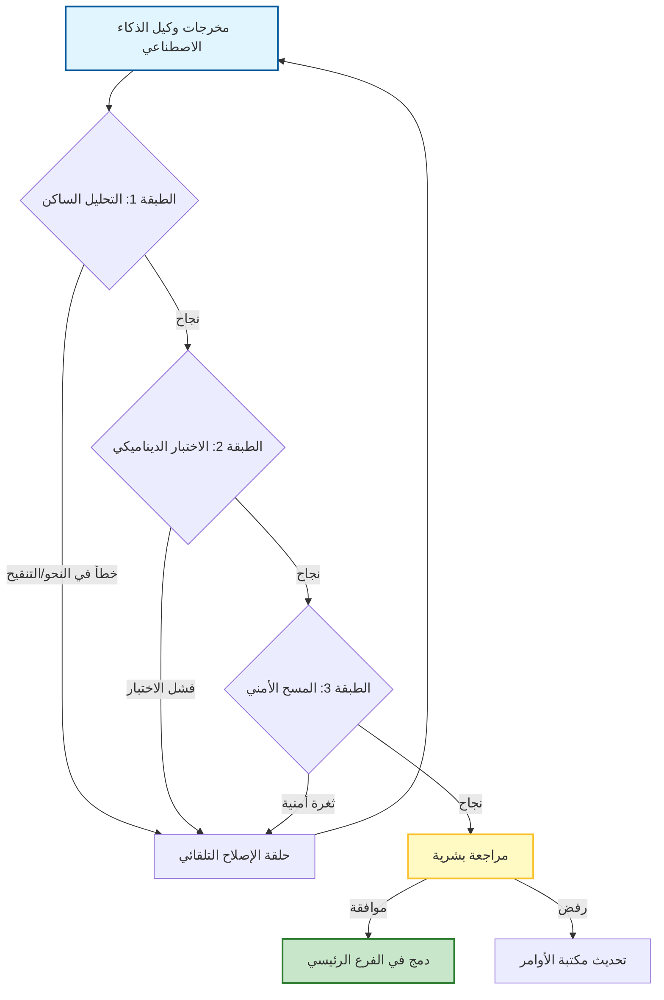

# 🧪 الدليل المفقود لهندسة التقييم والتحقق (Evaluation & Validation Engineering) في تطوير البرمجيات

### 🎯 أهداف التعلم
بحلول نهاية هذا الفصل، ستكون قادراً على:
*   تعريف **هندسة التقييم** كنظام متميز عن ضمان الجودة (QA) القياسي، مع التركيز على مخرجات الذكاء الاصطناعي الاحتمالية (Probabilistic AI outputs).
*   تطبيق تقنيات تحقق محددة مثل **اختبار الطفرات (Mutation Testing)** و **الاختبار التفاضلي (Differential Testing)** لالتقاط أخطاء الذكاء الاصطناعي الدقيقة.
*   تأسيس مقاييس رئيسية (مثل معدل النجاح، معدل نجاح الأمر) لقياس موثوقية وكلائك.
*   التنقل بين المقايضات (Trade-offs) الخاصة بصرامة التحقق، وكمون خط الأنابيب (Pipeline latency)، وتكلفة "النموذج اللغوي الكبير كحكم" (LLM-as-a-Judge).

---

## 1. 🎯 ما هي هندسة التقييم والتحقق؟

إنها نظام **التحقق المنهجي** من أن العناصر (Artifacts) المولدة بواسطة الذكاء الاصطناعي (كود، اختبارات، وثائق، خطوط أنابيب) تلبي معاييرك. على عكس الكود التقليدي الذي يكتبه البشر، فإن مخرجات الذكاء الاصطناعي احتمالية—قد تكون عبقرية في مرة وتهلوس (Hallucinate) بمكتبة غير موجودة في المرة التالية.

تجيب هندسة التقييم على السؤال: **"هل هذا آمن للشحن (Ship)؟"**

وهي تركز على أربع ركائز:
-   ✅ **الصحة (Correctness)** — هل يعمل كما هو مقصود؟
-   🔐 **الأمان (Security)** — هل هو آمن من الثغرات؟
-   ⚙️ **الأداء (Performance)** — هل هو فعال وقابل للتوسع؟
-   📚 **الامتثال (Compliance)** — هل يتبع اتفاقيات الفريق والقواعد القانونية/التراخيص؟

هذه هي **بوابة الجودة** بين مخرجات الذكاء الاصطناعي والإنتاج (Production).

### 📊 تصور خط أنابيب التحقق

لا يمكنك الاعتماد على المراجعة اليدوية وحدها. أنت بحاجة إلى نظام دفاع متعدد الطبقات يقوم بتصفية الكود السيئ قبل أن يصل إلى الإنسان.

---

## 2. 🧩 أين تتناسب في دورة حياة التطوير

| المرحلة | ما يجب تقييمه | كيفية التحقق |
| :--- | :--- | :--- |
| **توليد الكود** | المنطق، النحو (Syntax)، النمط | التنقيح (Linting)، التحليل الساكن، تغطية الاختبار |
| **توليد الاختبار** | التغطية، الحالات الحدية | اختبار الطفرات، فحوصات عدم استقرار الاختبار (Flakiness) |
| **خطوط أنابيب CI/CD** | موثوقية البناء (Build reliability) | التشغيلات التجريبية (Dry runs)، عمليات نشر في بيئة معزولة (Sandbox) |
| **الوثائق والمواصفات** | الدقة، الاكتمال | التحقق المتبادل مع قاعدة الكود، مراجعة الأقران |
| **إصلاح الأخطاء** | خطر الانحدار (Regression risk) | اختبارات الانحدار المؤتمتة، تحليل الفروقات (Diff analysis) |

---

## 3. 🛠️ الأدوات والتقنيات

للتحقق من الذكاء الاصطناعي، تحتاج إلى استراتيجية دفاع متعددة الطبقات:

### ✅ التحليل الساكن (Static Analysis)
-   **الغرض**: التقاط الأخطاء البرمجية، والثغرات الأمنية، وانتهاكات النمط دون تشغيل الكود. الذكاء الاصطناعي عرضة لـ "هلوسة" الاستيرادات (Imports) أو استخدام نحو مهمل (Deprecated syntax).
-   **الأدوات**: ESLint, SonarQube, Bandit (Python), Semgrep.

### 🧪 الاختبار المؤتمت (Automated Testing)
-   **الغرض**: التحقق من الصحة ومنع الانحدارات.
-   **الأنواع**:
    -   **اختبارات الوحدة (Unit tests)** (Jest, PyTest) للدوال الفردية.
    -   **اختبارات التكامل (Integration tests)** (Postman, Cypress) لتفاعلات API.
    -   **اختبارات من النهاية إلى النهاية (E2E tests)** (Playwright, Selenium) لتدفقات المستخدم.

### 🔁 اختبار الطفرات (Mutation Testing)
-   **الغرض**: التحقق مما إذا كانت اختباراتك تلتقط الأخطاء بالفعل. بما أن الذكاء الاصطناعي غالباً ما يكتب الاختبارات *و* الكود، فأنت بحاجة للتحقق من أن الاختبارات ليست مجرد "غسيل أخضر" (Green-washing) (تمرير النجاح دون اختبار المنطق فعلياً).
-   **الأدوات**: Stryker, Mutmut.

### 🧬 الاختبار التفاضلي (Differential Testing)
-   **الغرض**: مقارنة الكود المولد بواسطة الذكاء الاصطناعي مقابل سلوك خط الأساس (Baseline behavior).
-   **حالة الاستخدام**: عند إعادة هيكلة (Refactoring) كود قديم (Legacy) باستخدام الذكاء الاصطناعي، قم بتشغيل كل من الكود القديم والجديد مقابل نفس المدخلات لضمان تطابق المخرجات.

### 🔍 تدقيق المخرجات والأوامر (Prompt-Output Auditing)
-   **الغرض**: تقييم فعالية الأمر وجودة المخرجات بمرور الوقت.
-   **الطريقة**: تسجيل الأوامر + المخرجات، وتسجيل نقاط لها حسب الوضوح، والصحة، والفائدة.

---

## 4. 📏 مقاييس التقييم

لا يمكنك تحسين ما لا تقيسه. تتبع هذه المقاييس:

| المقياس | الوصف |
| :--- | :--- |
| **معدل النجاح (Pass rate)** | نسبة الكود/الاختبارات المولدة بواسطة الذكاء الاصطناعي التي تجتاز CI/CD من المحاولة الأولى. |
| **معدل الأخطاء (Bug rate)** | عدد الأخطاء التي أدخلها الكود المولد بواسطة الذكاء الاصطناعي مقابل الكود المكتوب بشرياً. |
| **وقت المراجعة** | الوقت الذي تم توفيره (أو إضافته) أثناء مراجعة الكود لطلبات السحب (PRs) المولدة بواسطة الذكاء الاصطناعي. |
| **دلتا تغطية الاختبار** | نسبة الزيادة في التغطية من الاختبارات المولدة بواسطة الذكاء الاصطناعي. |
| **معدل نجاح الأمر** | نسبة الأوامر التي تنتج مخرجات قابلة للاستخدام دون تحرير يدوي. |

---

## 5. 🔄 حلقات التغذية الراجعة

التحقق ليس خطوة لمرة واحدة؛ إنه يغذي النظام:

-   **مراجعة الإنسان في الحلقة (Human-in-the-loop)**: راجع دائماً مخرجات الذكاء الاصطناعي قبل الدمج.
-   **تحسين الأمر**: استخدم المخرجات الفاشلة لتحسين الأوامر المستقبلية.
-   **ضبط السياق**: عدل ما تغذيه للذكاء الاصطناعي بناءً على نتائج التحقق.
-   **التسجيل وتعيين النقاط**: تتبع الأوامر التي تنتج باستمرار نتائج عالية الجودة.

---

## 6. ⚖️ تكلفة الجودة: المقايضات والمخاطر

التقييم الصارم يأتي بثمن. يجب عليك الموازنة بين الثقة والسرعة (Velocity):

1.  **كمون التحقق (Validation Latency):** تشغيل اختبارات الطفرات أو التحليل الساكن المكثف على كل اقتراح ذكاء اصطناعي يمكن أن يبطئ حلقة التطوير.
    *   *التخفيف:* قم بتشغيل فحوصات خفيفة الوزن (Linting) محلياً وفحوصات ثقيلة (اختبار الطفرات) في CI.
2.  **الإيجابيات الكاذبة (False Positives):** قد تضع أدوات التحليل الساكن علامة خطأ على أنماط صالحة مولدة بواسطة الذكاء الاصطناعي، مما يسبب "إرهاق التنبيهات".
    *   *التخفيف:* اضبط مجموعات القواعد (Rulesets) الخاصة بك خصيصاً للكود المولد بواسطة الذكاء الاصطناعي.
3.  **تكلفة "النموذج اللغوي الكبير كحكم" (LLM-as-a-Judge):** استخدام نموذج قوي (مثل GPT-4) لتقييم مخرجات نموذج أصغر فعال ولكنه مكلف.
    *   *التخفيف:* استخدم أدوات الكود الحتمية (المترجمات، المنقحات) للفحوصات الموضوعية؛ استخدم LLMs فقط للفحوصات الذاتية (المقروئية، الوثائق).
4.  **الحتمية (Determinism):** يمكن أن تكون اختبارات الذكاء الاصطناعي غير مستقرة (Flaky). الاختبار الذي تم توليده اليوم قد يفشل غداً بسبب المخرجات غير الحتمية إذا لم يتم بذرها (Seeding) بشكل صحيح.
    *   *التخفيف:* فرض بذر وعزل صارم في الاختبارات المولدة.

---

## 7. 🛡️ أفضل الممارسات

-   **لا تتخطى التحقق أبداً** — حتى بالنسبة للكود المولد بواسطة الذكاء الاصطناعي "البسيط".
-   **أتمت كل شيء** — ادمج التحقق في CI/CD؛ سيتم تخطي الفحوصات اليدوية تحت الضغط.
-   **استخدم المسارات الذهبية (Golden paths)** — حافظ على أمثلة جيدة معروفة للمقارنة.
-   **وثق حالات الفشل** — ابنِ قاعدة معرفية لما لم ينجح ولماذا.
-   **قم بإصدار نسخ للأوامر (Version prompts)** — تعامل معها مثل الكود: تتبع، واختبر، وحسن.

---

## 8. 🔮 الاتجاه المستقبلي

-   **وكلاء التقييم الذاتي** — ذكاء اصطناعي ينتقد مخرجاته الخاصة قبل التقديم.
-   **التحقق كخدمة (Validation-as-a-service)** — واجهات برمجة تطبيقات (APIs) جاهزة لاختبار الكود المولد بواسطة الذكاء الاصطناعي.
-   **تسجيل الثقة (Trust scoring)** — مقاييس ثقة مرفقة بكل اقتراح ذكاء اصطناعي.
-   **حلقات الإصلاح التلقائي** — وكلاء يقومون بإصلاح مخرجاتهم الفاشلة بناءً على نتائج الاختبار (مثال: "فشل الاختبار بالخطأ X، يرجى إصلاح الكود").

---

### 📝 ملخص والخطوات التالية

**النقاط الرئيسية:**
*   مخرجات الذكاء الاصطناعي احتمالية؛ التحقق يجعلها حتمية.
*   استخدم **اختبار الطفرات** لضمان أن الاختبارات المولدة بواسطة الذكاء الاصطناعي ليست مجرد "غسيل أخضر".
*   وازن **تكلفة الجودة**—لا تدع التحقق يبطئ تدفق العمل إلى حد الزحف.

**القادم تالياً:**
يخبرك التحقق *إذا* كان هناك خطأ ما. تخبرك التغذية الراجعة *كيف* تصلحه. في **الفصل 06: الدليل المفقود للتكرار وحلقات التغذية الراجعة**، سنغلق الحلقة لنجعل نظامك أكثر ذكاءً بمرور الوقت.
