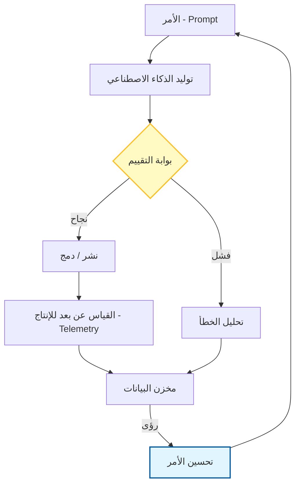

# 🔁 الدليل المفقود للتكرار وحلقات التغذية الراجعة (Iteration & Feedback Loops) في تطوير البرمجيات

### 🎯 أهداف التعلم
بحلول نهاية هذا الفصل، ستكون قادراً على:
*   تصميم أنظمة مغلقة الحلقة (Closed-loop systems) حيث يتم تسجيل نقاط مخرجات الذكاء الاصطناعي وتحسينها باستمرار.
*   تطبيق ثلاثة أنواع متميزة من حلقات التغذية الراجعة: **البشرية**، و **الذكاء الاصطناعي**، و **النظام**.
*   تطبيق أنماط تكرار محددة (مثل: "أمر ← مخرجات ← تسجيل نقاط ← تحسين").
*   التنقل في المقايضة الحرجة (Critical trade-off) بين رؤية البيانات ("سجل كل شيء") وخصوصية المستخدم (PII/GDPR).

---

## 1. 🎯 ما هي التكرارات وحلقات التغذية الراجعة؟

إنها **محرك التحسين المستمر** في تطوير البرمجيات. التكرار (Iteration) يعني **إعادة العملية** لتحسينها. تضمن حلقات التغذية الراجعة أن **تتعلم كل دورة من سابقتها** — سواء كان ذلك في الكود، التصميم، الاختبار، أو صياغة أوامر الذكاء الاصطناعي (Prompting).

بدون حلقات التغذية الراجعة، أنت مجرد مخمن. بوجودها، أنت تتطور. في سياق متمحور حول الذكاء الاصطناعي (AI-native)، تحول حلقة التغذية الراجعة الأمر الثابت (Static prompt) إلى نظام ديناميكي يصبح أكثر ذكاءً مع كل تنفيذ.

### 📊 تصور محرك التغذية الراجعة

حلقة التغذية الراجعة ليست مجرد دائرة؛ إنها لولب من التحسين.

---

## 2. 🧩 أين تتناسب حلقات التغذية الراجعة في دورة حياة التطوير

| المرحلة | مصدر التغذية الراجعة | إجراء التكرار |
| :--- | :--- | :--- |
| **التخطيط** | مراجعات أصحاب المصلحة، مقابلات المستخدمين | تحسين قصص المستخدم، تعديل النطاق |
| **التصميم** | نقد التصميم، اختبارات قابلية الاستخدام | تحديث المخططات الهيكلية (Wireframes)، تحسين تجربة المستخدم (UX) |
| **التكويد** | مراجعات الكود، التنقيح (Linting)، فشل الاختبارات | إعادة الهيكلة (Refactor)، إصلاح الأخطاء، تحسين النمط |
| **الاختبار** | تقارير تغطية الاختبار، سجلات الاختبارات غير المستقرة (Flaky tests) | إضافة حالات حدية، تثبيت استقرار الاختبارات |
| **النشر** | فشل CI/CD، سجلات التراجع (Rollback logs) | تصليب خطوط الأنابيب، تحسين عملية التراجع |
| **ما بعد الإصدار** | تعليقات المستخدمين، القياس عن بعد (Telemetry)، تقارير الأخطاء | تصحيح المشكلات، تحديد أولويات الميزات |

---

## 3. 🔄 أنواع حلقات التغذية الراجعة

### 🧠 حلقات التغذية الراجعة البشرية
-   **مراجعات الكود**: تعليقات الأقران حول المنطق، والنمط، والهيكل.
-   **نقد التصميم**: تعليقات UI/UX من المصممين والمستخدمين.
-   **الاستعراضات بأثر رجعي (Retrospectives)**: تفكير على مستوى الفريق فيما نجح وما لم ينجح.

### 🤖 حلقات التغذية الراجعة للذكاء الاصطناعي
-   **تحسين الأمر (Prompt refinement)**: تعديل الأوامر بناءً على جودة المخرجات.
-   **ضبط السياق**: إضافة/إزالة السياق لتحسين ملاءمة الذكاء الاصطناعي.
-   **تسجيل نقاط المخرجات**: تقييم اقتراحات الذكاء الاصطناعي من حيث الفائدة والصحة لضبط الاستجابات المستقبلية بدقة.

### 📈 حلقات التغذية الراجعة للنظام
-   **القياس عن بعد (Telemetry)**: بيانات الاستخدام في الوقت الفعلي لتوجيه التحسينات.
-   **مراقبة الأخطاء**: تقارير الأعطال (Crash reports)، السجلات، والتنبيهات.
-   **اختبار A/B**: مقارنة الإصدارات للتحقق من صحة التغييرات.

---

## 4. 🛠️ الأدوات التي تشغل حلقات التغذية الراجعة

| نوع الأداة | أمثلة |
| :--- | :--- |
| **مراجعة الكود** | GitHub PRs, GitLab Merge Requests |
| **تغذية CI/CD الراجعة** | GitHub Actions, CircleCI, Jenkins |
| **مراقبة الأخطاء** | Sentry, LogRocket, Datadog |
| **تعليقات المستخدمين** | Hotjar, FullStory, Intercom |
| **تسجيل الأوامر (Prompt Logging)** | LangSmith, PromptLayer, custom logs |

---

## 5. 🧪 أنماط تصميم حلقة التغذية الراجعة

### 🧬 1. أمر ← مخرجات ← تسجيل نقاط ← تحسين
استخدم هذا عند العمل مع وكلاء الذكاء الاصطناعي.
1.  **الأمر**: اطلب من الذكاء الاصطناعي توليد كود.
2.  **المخرجات**: استلم الكود.
3.  **تسجيل النقاط**: قم بتشغيل اختبار أو منقح (Linter). إذا فشل، سجل النتيجة 0.
4.  **التحسين**: أعد تغذية رسالة الخطأ إلى الذكاء الاصطناعي لتوليد إصلاح.

### 🔁 2. بناء ← اختبار ← تعلم ← تكرار
حلقة أجايل (Agile) الكلاسيكية. استخدم نتائج الاختبار وتعليقات المستخدمين لتوجيه السباق (Sprint) التالي.

### 🧭 3. تخطيط ← تنفيذ ← تفكر ← تعديل
رائع للاستعراضات بأثر رجعي وتحسين عمليات الفريق.

---

## 6. ⚖️ فخ التغذية الراجعة: المقايضات والمخاطر

جمع التغذية الراجعة ضروري، لكنه يقدم مخاطر محددة يجب إدارتها، خاصة فيما يتعلق بخصوصية البيانات.

1.  **مفارقة الخصوصية ("سجل كل شيء" مقابل GDPR):**
    *   *الخطر:* لتحسين الذكاء الاصطناعي، تريد تسجيل كل أمر ومخرج. ومع ذلك، إذا قام مطور بلصق معلومات تعريف شخصية (PII) لعميل أو مفتاح API في أمر ما عن طريق الخطأ، فإن "تسجيل كل شيء" يخلق خرقاً أمنياً دائماً.
    *   *التخفيف:* نفذ **تعقيم PII** (التنقيح/Redaction) على خط أنابيب التسجيل الخاص بك *قبل* وصول البيانات إلى التخزين. لا تسجل أبداً الأوامر الخام دون تصفية.
2.  **الإشارة مقابل الضجيج (Signal vs. Noise):**
    *   *الخطر:* الكثير من التغذية الراجعة (مثل آلاف تحذيرات التنقيح) يؤدي إلى "إرهاق التنبيهات" (Alert fatigue)، مما يتسبب في تجاهل المطورين للمشكلات الحرجة.
    *   *التخفيف:* اضبط حلقات التغذية الراجعة للتنبيه فقط بشأن المشكلات القابلة للتنفيذ وذات الأولوية العالية.
3.  **التجهيز الزائد (Over-Fitting):**
    *   *الخطر:* تعديل أمر لإصلاح حالة حدية محددة قد يكسر الأمر للحالات العامة (انحدار/Regression).
    *   *التخفيف:* قم دائماً بتشغيل مجموعة انحدار من الأوامر (المجموعة الذهبية - Golden Set) عند التكرار على تصميم الأمر.

---

## 7. 📏 مقاييس تهمك

| المقياس | ما يخبرك به |
| :--- | :--- |
| **وقت الدورة (Cycle time)** | مدى سرعة التكرار من الفكرة إلى التسليم. |
| **معدل تكرار الخطأ** | ما إذا كانت الإصلاحات ثابتة أم أنك تكرر الأخطاء. |
| **معدل نجاح الأمر** | نسبة أوامر الذكاء الاصطناعي التي تنتج مخرجات قابلة للاستخدام دون تحرير يدوي. |
| **معدل عدم استقرار الاختبار (Flakiness)** | استقرار مجموعة الاختبار الخاصة بك (عدم الاستقرار العالي يكسر حلقة التغذية الراجعة). |
| **تواتر النشر** | كم مرة تقوم بشحن التحسينات. |

---

## 8. 🛡️ أفضل الممارسات

-   **سجل بمسؤولية**: تتبع الأوامر والمخرجات، ولكن قم بتعقيم PII والأسرار أولاً.
-   **أغلق الحلقة**: لا تجمع التغذية الراجعة فقط — تصرف بناءً عليها. حلقة التغذية الراجعة التي لا تؤدي إلى تغيير هي مجرد ضجيج.
-   **أتمت حيثما أمكن**: يجب أن يحدث CI/CD، وتشغيل الاختبارات، وتسجيل نقاط الأوامر دون تدخل بشري.
-   **راجع بانتظام**: الاستعراضات الأسبوعية وتدقيقات الأوامر الشهرية تحافظ على صحة النظام.
-   **شارك الدروس**: ابنِ ثقافة تغذية راجعة حيث يتم التعامل مع الأخطاء كبيانات للتعلم، وليس كإخفاقات.

---

## 9. 🔮 الاتجاه المستقبلي

-   **أنظمة المعالجة الذاتية (Self-healing systems)**: وكلاء ذكاء اصطناعي يقومون بتصحيح الكود تلقائياً بناءً على حلقات التغذية الراجعة للأخطاء.
-   **وكلاء واعون بالتغذية الراجعة**: ذكاء اصطناعي يكيف أسلوبه بناءً على تسجيل النقاط التاريخي الخاص بك (مثال: تعلم أنك تفضل الكود المختصر).
-   **التغذية الراجعة عبر الوكلاء**: مخرجات وكيل تصبح مدخلات لآخر للتحسين (مثال: وكيل مراجع ينتقد وكيل مبرمج).

---

### 📝 ملخص والخطوات التالية

**النقاط الرئيسية:**
*   تحول حلقات التغذية الراجعة استخدام الذكاء الاصطناعي الثابت إلى نظام ديناميكي متعلم.
*   يجب عليك أتمتة دورة **تسجيل النقاط ← التحسين** للحصول على قيمة من وكلاء الذكاء الاصطناعي.
*   **تحذير الخصوصية:** "سجل كل شيء" خطير بدون تعقيم صارم لـ PII.

**القادم تالياً:**
تولد التغذية الراجعة بيانات. كيف تنظم تلك البيانات بحيث يمكن لفريقك (والذكاء الاصطناعي الخاص بك) استخدامها فعلياً؟ في **الفصل 07: الدليل المفقود لإدارة المعرفة**، سنحول المعلومات المبعثرة لفريقك إلى دماغ مهيكل.
