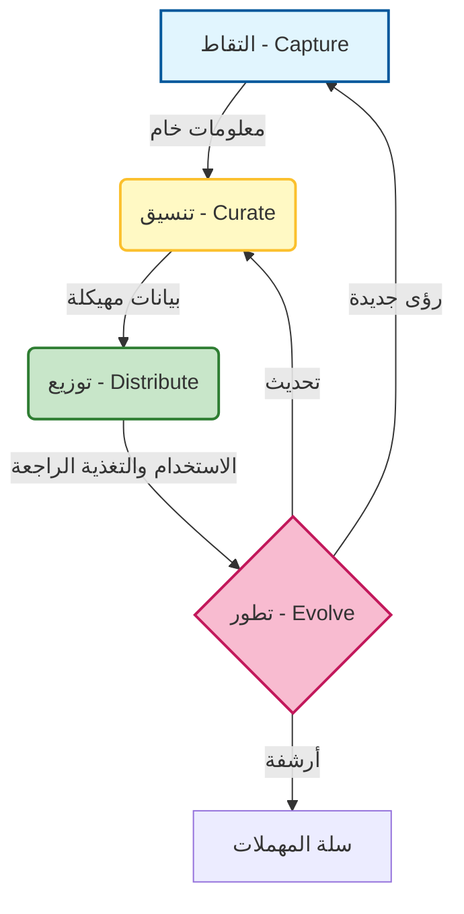

# 🧠 الدليل المفقود لإدارة المعرفة (Knowledge Management) في تطوير البرمجيات

### 🎯 أهداف التعلم
بحلول نهاية هذا الفصل، ستكون قادراً على:
*   تعريف **إدارة المعرفة (KM)** ليس فقط كـ "كتابة الوثائق"، بل كنظام استرجاع (Retrieval system) للبشر والذكاء الاصطناعي.
*   تصنيف أنواع مختلفة من المعرفة التطويرية (التقنية، العملية، المنتج، الذكاء الاصطناعي).
*   تطبيق **دورة حياة المعرفة** (الالتقاط ← التنسيق ← التوزيع ← التطور).
*   إدارة المقايضات الحرجة بين حداثة التوثيق ("تعفن المعرفة" أو Knowledge Rot) والتكلفة الزمنية للتنسيق (Curation).

---

## 1. 🎯 ما هي إدارة المعرفة؟

إدارة المعرفة (KM) في تطوير البرمجيات هي **العملية المنهجية لالتقاط، وتنسيق، وتنظيم، وتوزيع المعرفة** — بما في ذلك الكود، والقرارات، والتوثيق، والحكمة القبلية (Tribal wisdom) — بحيث يمكن للفرق ووكلاء الذكاء الاصطناعي إعادة استخدامها بفعالية.

في عالم متمحور حول الذكاء الاصطناعي (AI-native)، تتخذ إدارة المعرفة دوراً جديداً: إنها **بيانات التدريب** لوكلائك الداخليين. الأمر لا يتعلق فقط بتخزين المعلومات — بل يتعلق **بجعلها قابلة للوصول، وقابلة للتنفيذ، وحية**.

### 📊 تصور دورة حياة المعرفة

المعرفة ليست عنصراً ثابتاً (Static artifact)؛ إنها دورة حية. إذا انكسرت الدورة، تموت المعرفة (تتعفن).

---

## 2. 🧩 ما الذي يُحتسب كـ "معرفة" في عمل التطوير؟

| نوع المعرفة | أمثلة |
| :--- | :--- |
| **تقنية (Technical)** | مقتطفات الكود، واجهات برمجة التطبيقات (APIs)، مخططات المعمارية، أنماط الأخطاء. |
| **عملية (Process)** | خطوات النشر، أدلة التأهيل (Onboarding)، معايير التكويد. |
| **منتج (Product)** | مواصفات الميزات، قصص المستخدم، تعليقات العملاء. |
| **تاريخية (Historical)** | الأخطاء السابقة، قرارات التصميم (ADRs)، استعراضات السباق (Sprint retrospectives). |
| **خاصة بالذكاء الاصطناعي** | مكتبات الأوامر (Prompt libraries)، قوالب السياق، تقييمات المخرجات. |

---

## 3. 🛠️ أدوات لإدارة المعرفة

| الفئة | الأدوات |
| :--- | :--- |
| **التوثيق** | Confluence, Notion, GitHub Wiki, Docusaurus |
| **معرفة الكود** | Sourcegraph, Swimm, Mintlify |
| **البحث والاكتشاف** | Algolia, ElasticSearch, بحث ذكاء اصطناعي داخلي (RAG) |
| **إعادة استخدام الأمر/السياق** | PromptLayer, LangSmith, مكتبات أوامر مخصصة |
| **ذاكرة الفريق** | سلاسل رسائل Slack، مناقشات GitHub، الاستعراضات بأثر رجعي |

---

## 4. 🔄 خطوات دورة حياة المعرفة

### 1. الالتقاط (Capture)
-   اكتب القرارات، والأنماط، والدروس المستفادة فوراً.
-   استخدم الذكاء الاصطناعي لتلخيص الاجتماعات، أو طلبات السحب (PRs)، أو سلاسل Slack إلى مسودات أولية.
-   سجل الأوامر، والمخرجات، والتغذية الراجعة من وكلاء الذكاء الاصطناعي لالتقاط "ما ينجح".

### 2. التنسيق (Curate)
-   نظف الوثائق القديمة. **المعرفة القديمة أسوأ من عدم وجود معرفة.**
-   قم بوسم وتصنيف المحتوى (مثال: `#frontend`, `#CI/CD`, `#React`).
-   استخدم القوالب للاتساق (مثال: RFCs، تقارير الأخطاء، تنسيقات الأوامر).

### 3. التوزيع (Distribute)
-   اربط الوثائق في طلبات السحب (PRs)، والتذاكر، وتدفقات التأهيل.
-   استخدم وكلاء الذكاء الاصطناعي لإظهار المعرفة ذات الصلة في السياق (مثال: بوت يقترح وثيقة بناءً على سؤال في Slack).
-   ابنِ بحثاً داخلياً يمتد عبر الكود + الوثائق + الدردشة.

### 4. التطور (Evolve)
-   راجع وحدث الوثائق أثناء الاستعراضات بأثر رجعي أو تخطيط السباق (Sprint planning).
-   تتبع الاستخدام: أي الوثائق مفيدة؟ وأيها يتم تجاهله؟
-   قم بالتحكم في إصدارات (Version control) أوامرك، ومعماريتك، وقراراتك تماماً مثل الكود.

---

## 5. 🧩 أنماط لإدارة المعرفة المعززة بالذكاء الاصطناعي

-   **مكتبات الأوامر (Prompt Libraries)**: تخزين الأوامر القابلة لإعادة الاستخدام للتكويد، والاختبار، والتصحيح حتى لا يعيد الفريق اختراع العجلة.
-   **قوالب السياق (Context Templates)**: كتل سياق مسبقة البناء لوكلاء مختلفين (مثال: "سياق نشر React + GitHub Pages").
-   **التلخيص التلقائي**: استخدم الذكاء الاصطناعي لتلخيص PRs، أو الاجتماعات، أو السجلات إلى عناصر معرفية قابلة للمشاركة.
-   **وكلاء واعون بالمعرفة**: قم بتغذية الوكلاء بوثائق داخلية منسقة (RAG) لتحسين جودة المخرجات وتقليل الهلوسة.

---

## 6. ⚖️ عبء المعرفة: المقايضات والمخاطر

بناء قاعدة معرفة هو استثمار. يجب عليك الموازنة بين قيمة المعلومات وتكلفة صيانتها.

1.  **تعفن المعرفة (Knowledge Rot):**
    *   *الخطر:* يشيخ التوثيق في اللحظة التي يُكتب فيها. إذا قرأ وكيل الذكاء الاصطناعي وثائق قديمة، فسيولد كوداً قديماً.
    *   *التخفيف:* نفذ "وقت البقاء" (TTL) على الوثائق. ضع علامة "بائت" (Stale) عليها تلقائياً إذا لم يتم تحديثها خلال 6 أشهر.
2.  **معضلة المنسق (Curator's Dilemma):**
    *   *الخطر:* كل ساعة تقضيها في تنظيم Notion هي ساعة لا تقضيها في شحن الكود. الإفراط في التنسيق يؤدي إلى البيروقراطية.
    *   *التخفيف:* ركز على التوثيق "في الوقت المناسب" (Just-in-Time). وثق القرارات (لماذا)، وليس فقط التنفيذ (كيف)، لأن التنفيذ يتغير بشكل أسرع.
3.  **تسرب البيانات عبر RAG:**
    *   *الخطر:* إذا قمت بفهرسة جميع الوثائق الداخلية لبوت بحث الذكاء الاصطناعي، فقد يظهر بيانات الموارد البشرية الحساسة أو الأسرار للمطورين الذين لا ينبغي لهم رؤيتها.
    *   *التخفيف:* نفذ قوائم تحكم في الوصول (ACLs) صارمة على بحث المعرفة الخاص بك. تأكد من أن الذكاء الاصطناعي يحترم أذونات المستخدم.

---

## 7. 📏 مقاييس تهمك

| المقياس | لماذا يهم |
| :--- | :--- |
| **وقت التأهيل (Time to onboard)** | يقيس مدى سرعة إنتاجية المطورين الجدد باستخدام قاعدة المعرفة الخاصة بك. |
| **معدل إعادة استخدام المعرفة** | يتتبع عدد مرات الوصول إلى الوثائق/الأوامر/القوالب أو الإشارة إليها. |
| **معدل نجاح البحث** | نسبة عمليات البحث الداخلية التي تسفر عن نتائج مفيدة. |
| **حداثة الوثائق** | نسبة الوثائق التي تم تحديثها في آخر 90 يوماً. |
| **دلتا جودة مخرجات الذكاء الاصطناعي** | التحسن في اقتراحات الذكاء الاصطناعي بعد تغذيته بسياق/مكتبات أوامر أفضل. |

---

## 8. 🛡️ أفضل الممارسات

-   **وثق القرارات، وليس الكود فقط** — خاصة المقايضات والخيارات المرفوضة (سجلات قرارات المعمارية - ADRs).
-   **اجعل المعرفة قابلة للاكتشاف** — استخدم الوسوم، والبحث، والربط. الوثيقة التي لا يستطيع أحد العثور عليها غير موجودة.
-   **اجعلها خفيفة الوزن** — قصيرة، قابلة للتصفح السريع، وقابلة للتنفيذ أفضل من طويلة ومغبرة.
-   **ادمجها في تدفقات العمل** — يجب أن تعيش الوثائق حيث يعمل المطورون (PRs، المشكلات/Issues، بيئات التطوير/IDEs).
-   **عامل الأوامر والسياق كأصول من الدرجة الأولى** — قم بإصدار نسخ منها، ومراجعتها، وإعادة استخدامها.

---

## 9. 🔮 الاتجاه المستقبلي

-   **رسوم بيانية للمعرفة (Knowledge graphs) أصيلة في الذكاء الاصطناعي** — ربط الكود، والوثائق، والقرارات، والأشخاص تلقائياً.
-   **توثيق ذاتي التحديث** — ذكاء اصطناعي يراقب تغييرات الكود ويحدث الوثائق المقابلة (بموافقة بشرية).
-   **CI/CD واعي بالمعرفة** — خطوط أنابيب تتحقق من الكود مقابل القرارات المعمارية المخزنة في قاعدة المعرفة.
-   **ذاكرة الوكيل** — وكلاء ذكاء اصطناعي يتذكرون التفاعلات السابقة ويتطورون مع فريقك.

---

### 📝 ملخص والخطوات التالية

**النقاط الرئيسية:**
*   إدارة المعرفة هي سلسلة التوريد لوكلاء الذكاء الاصطناعي الخاصين بك؛ قم بتغذيتهم ببيانات عالية الجودة.
*   **نسق (Curate)** بقوة لمنع تعفن المعرفة.
*   عامل **الأوامر** و **السياق** كأصول معرفية يجب إصدار نسخ منها ومشاركتها.

**القادم تالياً:**
لديك الأدوات، وتدفقات العمل، والمعرفة. ولكن كيف تضمن أنك تبني الشيء *الصحيح*، بالطريقة *الصحيحة*؟ في **الفصل 08: الدليل المفقود للأخلاقيات والحوكمة**، سنناقش حواجز الحماية التي تحافظ على نظام الذكاء الاصطناعي الخاص بك آمناً ومسؤولاً.
