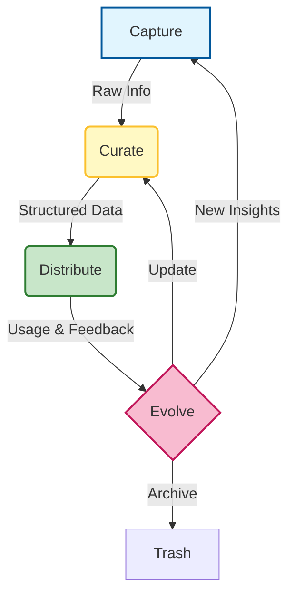

# 🧠 The Missing Guide to Knowledge Management in Software Development

### 🎯 Learning Objectives
By the end of this chapter, you will be able to:
*   Define **Knowledge Management (KM)** not just as "writing docs," but as building a retrieval system for humans and AI.
*   Categorize different types of development knowledge (Technical, Process, Product, AI).
*   Implement the **Knowledge Lifecycle** (Capture → Curate → Distribute → Evolve).
*   Manage the critical trade-offs between documentation freshness ("Knowledge Rot") and the time cost of curation.

---

## 1. 🎯 What Is Knowledge Management?

Knowledge Management (KM) in software development is the **systematic process of capturing, curating, organizing, and distributing knowledge** — including code, decisions, documentation, and tribal wisdom — so that teams and AI agents can reuse it effectively.

In an AI-native world, KM takes on a new role: it is the **training data** for your internal agents. It’s not just about storing information — it’s about **making it accessible, actionable, and alive**.

### 📊 Visualizing the Knowledge Lifecycle

Knowledge is not a static artifact; it is a living cycle. If the cycle breaks, the knowledge dies (rots).

---

## 2. 🧩 What Counts as “Knowledge” in Dev Work?

| Knowledge Type | Examples |
| :--- | :--- |
| **Technical** | Code snippets, APIs, architecture diagrams, error patterns. |
| **Process** | Deployment steps, onboarding guides, coding standards. |
| **Product** | Feature specs, user stories, customer feedback. |
| **Historical** | Past bugs, design decisions (ADRs), sprint retrospectives. |
| **AI-specific** | Prompt libraries, context templates, output evaluations. |

---

## 3. 🛠️ Tools for Knowledge Management

| Category | Tools |
| :--- | :--- |
| **Documentation** | Confluence, Notion, GitHub Wiki, Docusaurus |
| **Code Knowledge** | Sourcegraph, Swimm, Mintlify |
| **Search & Discovery** | Algolia, ElasticSearch, internal AI search (RAG) |
| **Prompt/Context Reuse** | PromptLayer, LangSmith, custom prompt libraries |
| **Team Memory** | Slack threads, GitHub Discussions, retrospectives |

---

## 4. 🔄 The Knowledge Lifecycle Steps

### 1. Capture
-   Write down decisions, patterns, and lessons learned immediately.
-   Use AI to summarize meetings, PRs, or Slack threads into rough drafts.
-   Log prompts, outputs, and feedback from AI agents to capture "what works."

### 2. Curate
-   Clean up outdated docs. **Outdated knowledge is worse than no knowledge.**
-   Tag and categorize content (e.g., `#frontend`, `#CI/CD`, `#React`).
-   Use templates for consistency (e.g., RFCs, bug reports, prompt formats).

### 3. Distribute
-   Link docs in PRs, tickets, and onboarding flows.
-   Use AI agents to surface relevant knowledge in context (e.g., a bot that suggests a doc based on a Slack question).
-   Build internal search that spans code + docs + chat.

### 4. Evolve
-   Review and update docs during retrospectives or sprint planning.
-   Track usage: which docs are helpful? Which are ignored?
-   Version control your prompts, architecture, and decisions just like code.

---

## 5. 🧩 Patterns for AI-Enhanced KM

-   **Prompt Libraries**: Store reusable prompts for coding, testing, and debugging so the team doesn't reinvent the wheel.
-   **Context Templates**: Pre-built context blocks for different agents (e.g., “React + GitHub Pages deployment context”).
-   **Auto-summarization**: Use AI to summarize PRs, meetings, or logs into shareable knowledge artifacts.
-   **Knowledge-aware Agents**: Feed agents with curated internal docs (RAG) to improve output quality and reduce hallucinations.

---

## 6. ⚖️ The Knowledge Burden: Trade-offs & Risks

Building a knowledge base is an investment. You must balance the value of information against the cost of maintaining it.

1.  **Knowledge Rot:**
    *   *Risk:* Documentation ages the moment it is written. If an AI agent reads outdated docs, it will generate outdated code.
    *   *Mitigation:* Implement "Time-to-Live" (TTL) on docs. Mark them as "Stale" automatically if not updated in 6 months.
2.  **The Curator's Dilemma:**
    *   *Risk:* Every hour spent organizing Notion is an hour not spent shipping code. Over-curation leads to bureaucracy.
    *   *Mitigation:* Focus on "Just-in-Time" documentation. Document decisions (Why), not just implementation (How), as implementation changes faster.
3.  **Data Leakage via RAG:**
    *   *Risk:* If you index all internal docs for an AI search bot, it might surface sensitive HR data or secrets to developers who shouldn't see them.
    *   *Mitigation:* Implement strict Access Control Lists (ACLs) on your knowledge search. Ensure the AI respects user permissions.

---

## 7. 📏 Metrics That Matter

| Metric | Why It Matters |
| :--- | :--- |
| **Time to onboard** | Measures how fast new devs become productive using your knowledge base. |
| **Knowledge reuse rate** | Tracks how often docs/prompts/templates are accessed or referenced. |
| **Search success rate** | % of internal searches that yield helpful results. |
| **Doc freshness** | % of docs updated in the last 90 days. |
| **AI output quality delta** | Improvement in AI suggestions after feeding it better context/prompt libraries. |

---

## 8. 🛡️ Best Practices

-   **Document decisions, not just code** — especially trade-offs and rejected options (Architecture Decision Records).
-   **Make knowledge discoverable** — use tags, search, and linking. A doc no one can find doesn't exist.
-   **Keep it lightweight** — short, skimmable, and actionable beats long and dusty.
-   **Integrate into workflows** — docs should live where devs work (PRs, issues, IDEs).
-   **Treat prompts and context as first-class assets** — version, review, and reuse them.

---

## 9. 🔮 Future Direction

-   **AI-native knowledge graphs** — connecting code, docs, decisions, and people automatically.
-   **Self-updating documentation** — AI that watches code changes and updates the corresponding docs (with human approval).
-   **Knowledge-aware CI/CD** — pipelines that validate code against architectural decisions stored in the knowledge base.
-   **Agent memory** — AI agents that remember past interactions and evolve with your team.

---

### 📝 Summary & Next Steps

**Key Takeaways:**
*   KM is the supply chain for your AI agents; feed them high-quality data.
*   **Curate** aggressively to prevent Knowledge Rot.
*   Treat **Prompts** and **Context** as knowledge assets to be versioned and shared.

**Coming Up Next:**
You have the tools, the workflows, and the knowledge. But how do you ensure you're building the *right* thing, the *right* way? In **Chapter 08: The Missing Guide to Ethics & Governance**, we will discuss the guardrails that keep your AI system safe and responsible.