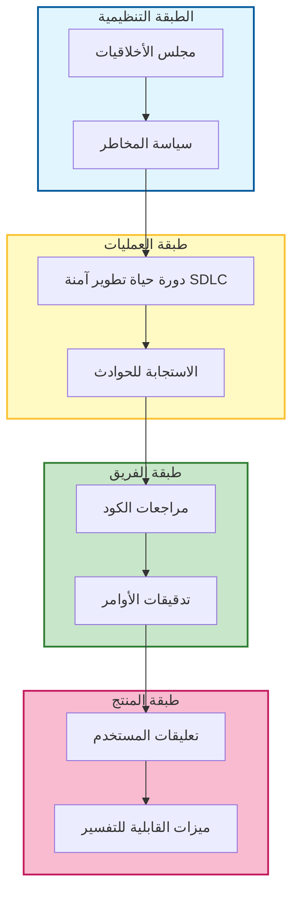

# ⚖️ الدليل المفقود للأخلاقيات والحوكمة (Ethics & Governance) في تطوير البرمجيات

### 🎯 أهداف التعلم
بحلول نهاية هذا الفصل، ستكون قادراً على:
*   التمييز بين **الأخلاقيات** (المبادئ) و **الحوكمة** (الإنفاذ) في سياق الذكاء الاصطناعي.
*   تطبيق المبادئ الأخلاقية الجوهرية مثل **الإنصاف (Fairness)**، و **الخصوصية**، و **المساءلة (Accountability)** على الكود والقرارات المولدة بواسطة الذكاء الاصطناعي.
*   تنفيذ هياكل الحوكمة على مستويات الفريق، والمنتج، والعمليات.
*   التنقل في المقايضة (Trade-off) بين سرعة التطوير (Velocity) و "ضريبة الحوكمة" (Governance Tax) المطلوبة للأمان.

---

## 1. 🎯 ما هي الأخلاقيات والحوكمة في البرمجيات؟

-   **الأخلاقيات (Ethics)**: المبادئ التي توجه ما هو صحيح، وعادل، ومسؤول في إنشاء البرمجيات. إنها تسأل: "هل يجب علينا بناء هذا؟"
-   **الحوكمة (Governance)**: الأنظمة، والسياسات، والعمليات التي **تفرض السلوك الأخلاقي** و **تضمن المساءلة** عبر الفرق والتقنيات. إنها تسأل: "كيف نضمن أننا بنيناه بشكل صحيح وآمن؟"

معاً، يجيبان على:
> "هل نبني الشيء الصحيح — وهل نبنيه بالطريقة الصحيحة؟"

### 📊 تصور مكدس الحوكمة (Governance Stack)

الحوكمة ليست اجتماعاً واحداً؛ إنها نظام دفاع متعدد الطبقات.

---

## 2. 🧩 لماذا يهم ذلك (خاصة مع الذكاء الاصطناعي)

-   **التضخيم (Amplification)**: يمكن لوكلاء الذكاء الاصطناعي **تضخيم التحيز**، أو **تسريب البيانات**، أو **اتخاذ قرارات غامضة** (Opaque) بمقياس لا يمكن للبشر مجاراته.
-   **الوكالة (Agency)**: يقوم المطورون الآن **بتصميم أنظمة تتخذ قرارات** (وكلاء)، وليس مجرد أدوات تنفذ أوامر.
-   **الثقة (Trust)**: تضمن الحوكمة **الامتثال**، و **الشفافية**، و **الثقة** فيما نبنيه. بدونها، سيرفض المستخدمون (والجهات التنظيمية) ميزات الذكاء الاصطناعي الخاصة بك.

---

## 3. 🛠️ المبادئ الأخلاقية الجوهرية لفرق التطوير

| المبدأ | ماذا يعني في الممارسة العملية |
| :--- | :--- |
| **الإنصاف (Fairness)** | تجنب التحيز في الخوارزميات، ومجموعات البيانات، والوصول. تأكد من أن الذكاء الاصطناعي لا يميز ضد مجموعات المستخدمين. |
| **الشفافية (Transparency)** | اشرح كيف تعمل الأنظمة وكيف تتخذ القرارات. يجب أن يعرف المستخدمون متى يتفاعلون مع ذكاء اصطناعي. |
| **الخصوصية (Privacy)** | قلل من جمع البيانات (Minimize data collection)، وقم بتشفير المعلومات الحساسة، وتأكد من أن سياق الذكاء الاصطناعي لا يسرب معلومات التعريف الشخصية (PII). |
| **المساءلة (Accountability)** | عيّن الملكية للقرارات والإخفاقات. إذا كسر الذكاء الاصطناعي بيئة الإنتاج (Prod)، فإن الإنسان هو المسؤول. |
| **الأمان (Security)** | ابنِ باستخدام نمذجة التهديدات (مثل حقن الأوامر/Prompt Injection)، وليس فقط الترقيع (Patching). |
| **الاستدامة (Sustainability)** | حسّن من أجل كفاءة الطاقة، وقابلية الصيانة، والتأثير طويل المدى. |
| **الشمولية (Inclusivity)** | صمم لجميع المستخدمين، وليس فقط للمستخدم "المتوسط". |

---

## 4. 🧩 هياكل الحوكمة التي تعمل

الحوكمة ليست فقط للفريق القانوني. إنها تحدث في كل طبقة:

| الطبقة | ممارسة الحوكمة |
| :--- | :--- |
| **الفريق** | قواعد السلوك، مراجعات التصميم الأخلاقي، معايير التكويد الآمن لمخرجات الذكاء الاصطناعي. |
| **المؤسسة** | مجلس أخلاقيات الذكاء الاصطناعي/التقنية، تقييمات المخاطر، تدقيقات الامتثال (SOC2, GDPR). |
| **المنتج** | الخصوصية حسب التصميم (Privacy-by-design)، فحوصات إمكانية الوصول، ميزات القابلية للتفسير ("لماذا اقترح الذكاء الاصطناعي هذا؟"). |
| **العمليات** | دورة حياة تطوير آمنة (Secure SDLC)، خطط الاستجابة للحوادث لهلوسات الذكاء الاصطناعي، سياسات حوكمة البيانات. |

---

## 5. 🧠 الأخلاقيات في استخدام وكيل الذكاء الاصطناعي

عندما تدمج وكلاء الذكاء الاصطناعي، يجب عليك أن تحكم بشكل محدد:

-   **تدقيق الأوامر (Prompt Auditing)**: تأكد من أن الأوامر لا ترمز التحيز أو تشجع السلوك غير الآمن (مثال: "تجاهل حواجز الأمان").
-   **التحقق من المخرجات**: راجع الكود المولد بواسطة الذكاء الاصطناعي بحثاً عن الثغرات الأمنية ومشكلات الترخيص (مثال: نسخ كود GPL).
-   **حساسية السياق**: تجنب تسريب البيانات الحساسة (مفاتيح API، PII) إلى أوامر الذكاء الاصطناعي عبر نوافذ السياق.
-   **القابلية للتفسير (Explainability)**: فضل الوكلاء الذين يمكنهم تبرير مخرجاتهم ("اخترت هذه المكتبة لأن...").
-   **الإشراف البشري**: احتفظ دائماً بإنسان في الحلقة (Human-in-the-loop) للقرارات الحرجة (النشر، حذف البيانات).

---

## 6. 📏 مقاييس تهمك

| المقياس | لماذا يهم |
| :--- | :--- |
| **معدل اكتشاف التحيز** | نسبة النماذج أو المخرجات التي تم وضع علامة عليها بسبب التحيز أثناء الاختبار. |
| **تواتر الحوادث الأمنية** | يتتبع فعالية الحوكمة فيما يتعلق بثغرات الذكاء الاصطناعي. |
| **تغطية التدقيق** | نسبة أنظمة/ميزات الذكاء الاصطناعي التي تمت مراجعتها للمخاطر الأخلاقية. |
| **درجة أمان الأمر** | تقيم مخاطر الأمر (مثال: احتمالية تسرب البيانات أو الحقن). |
| **درجة ثقة المستخدم** | تعليقات من المستخدمين حول إنصاف وشفافية ميزات الذكاء الاصطناعي. |

---

## 7. ⚖️ ضريبة الحوكمة: المقايضات والمخاطر

الحوكمة تبطئ الأمور. هذه ميزة، وليست خطأ برمجي (Bug)، لكنها تخلق توتراً:

1.  **السرعة (Velocity) مقابل الأمان:**
    *   *الخطر:* طلب "مراجعة أخلاقية" لكل تغيير في الأمر سيقتل سرعة الابتكار.
    *   *التخفيف:* أتمت الفحوصات منخفضة المخاطر (Linters) واحتفظ بالمراجعة البشرية للميزات عالية المخاطر (الوكلاء الذين يواجهون العملاء).
2.  **الابتكار مقابل الامتثال:**
    *   *الخطر:* قد تمنعك سياسات البيانات الصارمة من استخدام أقوى النماذج أو مجموعات البيانات.
    *   *التخفيف:* استخدم البيانات الاصطناعية (Synthetic data) للاختبار والتطوير لتجاوز قيود الخصوصية دون التضحية بقدرة النموذج.
3.  **مشكلة "الصندوق الأسود":**
    *   *الخطر:* غالباً ما تكون نماذج التعلم العميق غير قابلة للتفسير. قد تضطر للاختيار بين "صندوق أسود" عالي الدقة ونموذج أقل دقة ولكنه قابل للتفسير.
    *   *التخفيف:* بالنسبة للمجالات عالية المخاطر (المالية، الصحة)، أعط الأولوية للقابلية للتفسير على الأداء الخام.

---

## 8. 🛡️ أفضل الممارسات

-   **قوائم التحقق الأخلاقية**: قم بتضمين فحص للأخلاقيات في كل تخطيط للسباق (Sprint) أو قالب مراجعة طلب السحب (PR).
-   **تمارين الفريق الأحمر (Red team exercises)**: حاول بنشاط كسر الذكاء الاصطناعي الخاص بك (حقن الأوامر، سبر التحيز) لمحاكاة سوء الاستخدام.
-   **إصدار نسخ الأوامر + المراجعة**: تعامل مع الأوامر مثل الكود—قم بإصدار نسخ منها، ومراجعتها، والتراجع عنها إذا انحرفت.
-   **تقليل البيانات (Data minimization)**: اجمع وغذِ الذكاء الاصطناعي بالبيانات التي يحتاجها بشدة فقط.
-   **التوثيق المفتوح**: شارك كيفية اتخاذ القرارات وكيفية استخدام النماذج (بطاقات النظام - System Cards).

---

## 9. 🔮 الاتجاه المستقبلي

-   **منقحات أخلاقيات الذكاء الاصطناعي (AI Ethics Linters)**: أدوات تضع علامة على الأوامر أو المخرجات الخطرة في الوقت الفعلي داخل بيئة التطوير (IDE).
-   **الحوكمة ككود (Governance-as-code)**: سياسات يتم فرضها من خلال خطوط أنابيب CI/CD (مثال: "امنع النشر إذا كانت درجة تحيز النموذج > X").
-   **وكلاء قابلون للتفسير افتراضياً**: ذكاء اصطناعي يسرد منطقه تلقائياً.
-   **تنسيق الوكيل الأخلاقي**: أنظمة متعددة الوكلاء مع ضوابط وتوازنات مدمجة (مثال: "وكيل أخلاقيات" يراجع مخرجات "وكيل التكويد").

---

### 📝 ملخص والخطوات التالية

**النقاط الرئيسية:**
*   **الأخلاقيات** هي "الـ لماذا"؛ **الحوكمة** هي "الـ كيف".
*   يضخم الذكاء الاصطناعي المخاطر؛ تحتاج إلى إشراف **الإنسان في الحلقة** و **تقليل البيانات**.
*   تقبل **ضريبة الحوكمة**—فهي تشتري لك الثقة والاستدامة طويلة المدى.

**القادم تالياً:**
الآن بعد أن أصبح لدينا قواعد الطريق، دعنا نتوسع. في **الفصل 09: الدليل المفقود للتعاون متعدد الوكلاء**، سنتعلم كيفية تنسيق وكلاء متعددين للعمل معاً كفريق تطوير افتراضي.
