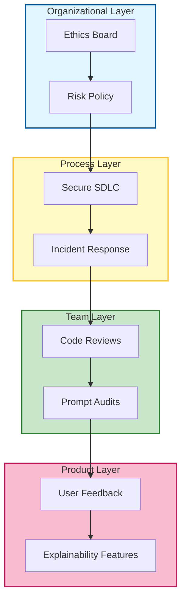

# ⚖️ The Missing Guide to Ethics & Governance in Software Development

### 🎯 Learning Objectives
By the end of this chapter, you will be able to:
*   Distinguish between **Ethics** (principles) and **Governance** (enforcement) in the context of AI.
*   Apply core ethical principles like **Fairness**, **Privacy**, and **Accountability** to AI-generated code and decisions.
*   Implement governance structures at the Team, Product, and Process levels.
*   Navigate the trade-off between development velocity and the "Governance Tax" required for safety.

---

## 1. 🎯 What Are Ethics & Governance in Software?

-   **Ethics**: The principles guiding what’s right, fair, and responsible in software creation. It asks, "Should we build this?"
-   **Governance**: The systems, policies, and processes that **enforce ethical behavior** and **ensure accountability** across teams and technologies. It asks, "How do we ensure we built it correctly and safely?"

Together, they answer:
> “Are we building the right thing — and building it the right way?”

### 📊 Visualizing the Governance Stack

Governance isn't a single meeting; it's a layered defense system.

---

## 2. 🧩 Why It Matters (Especially with AI)

-   **Amplification**: AI agents can **amplify bias**, **leak data**, or **make opaque decisions** at a scale humans cannot match.
-   **Agency**: Developers are now **designing systems that make decisions** (agents), not just tools that execute commands.
-   **Trust**: Governance ensures **compliance**, **transparency**, and **trust** in what we build. Without it, users (and regulators) will reject your AI features.

---

## 3. 🛠️ Core Ethical Principles for Dev Teams

| Principle | What It Means in Practice |
| :--- | :--- |
| **Fairness** | Avoid bias in algorithms, datasets, and access. Ensure the AI doesn't discriminate against user groups. |
| **Transparency** | Explain how systems work and make decisions. Users should know when they are interacting with AI. |
| **Privacy** | Minimize data collection, encrypt sensitive info, and ensure AI context doesn't leak PII. |
| **Accountability** | Assign ownership for decisions and failures. If the AI breaks prod, a human is responsible. |
| **Security** | Build with threat modeling (e.g., prompt injection), not just patching. |
| **Sustainability** | Optimize for energy efficiency, maintainability, and long-term impact. |
| **Inclusivity** | Design for all users, not just the “average” one. |

---

## 4. 🧩 Governance Structures That Work

Governance isn't just for the legal team. It happens at every layer:

| Layer | Governance Practice |
| :--- | :--- |
| **Team** | Code of conduct, ethical design reviews, secure coding standards for AI outputs. |
| **Org** | AI/Tech Ethics Board, risk assessments, compliance audits (SOC2, GDPR). |
| **Product** | Privacy-by-design, accessibility checks, explainability features ("Why did the AI suggest this?"). |
| **Process** | Secure SDLC, incident response plans for AI hallucinations, data governance policies. |

---

## 5. 🧠 Ethics in AI Agent Use

When you integrate AI agents, you must specifically govern:

-   **Prompt Auditing**: Ensure prompts don’t encode bias or encourage unsafe behavior (e.g., "Ignore safety rails").
-   **Output Validation**: Review AI-generated code for security vulnerabilities and licensing issues (e.g., copying GPL code).
-   **Context Sensitivity**: Avoid leaking sensitive data (API keys, PII) into AI prompts via context windows.
-   **Explainability**: Prefer agents that can justify their outputs (“I chose this library because...”).
-   **Human Oversight**: Always keep a human in the loop for critical decisions (deployment, deleting data).

---

## 6. 📏 Metrics That Matter

| Metric | Why It Matters |
| :--- | :--- |
| **Bias detection rate** | % of models or outputs flagged for bias during testing. |
| **Security incident frequency** | Tracks governance effectiveness regarding AI vulnerabilities. |
| **Audit coverage** | % of AI systems/features reviewed for ethical risk. |
| **Prompt safety score** | Evaluates prompt risk (e.g., likelihood of data leakage or injection). |
| **User trust score** | Feedback from users on fairness and transparency of AI features. |

---

## 7. ⚖️ The Governance Tax: Trade-offs & Risks

Governance slows things down. This is a feature, not a bug, but it creates tension:

1.  **Velocity vs. Safety:**
    *   *Risk:* Requiring an "Ethics Review" for every prompt change will kill innovation speed.
    *   *Mitigation:* Automate low-risk checks (linters) and reserve human review for high-risk features (customer-facing agents).
2.  **Innovation vs. Compliance:**
    *   *Risk:* Strict data policies might prevent you from using the most powerful models or datasets.
    *   *Mitigation:* Use synthetic data for testing and development to bypass privacy constraints without sacrificing model capability.
3.  **The "Black Box" Problem:**
    *   *Risk:* Deep learning models are often unexplainable. You may have to choose between a highly accurate "black box" and a less accurate but explainable model.
    *   *Mitigation:* For high-stakes domains (finance, health), prioritize explainability over raw performance.

---

## 8. 🛡️ Best Practices

-   **Ethics checklists**: Include an ethics check in every sprint planning or PR review template.
-   **Red team exercises**: Actively try to break your AI (prompt injection, bias probing) to simulate misuse.
-   **Prompt versioning + review**: Treat prompts like code—version them, review them, and rollback if they drift.
-   **Data minimization**: Only collect and feed the AI the data it strictly needs.
-   **Open documentation**: Share how decisions are made and how models are used (System Cards).

---

## 9. 🔮 Future Direction

-   **AI Ethics Linters**: Tools that flag risky prompts or outputs in real time within the IDE.
-   **Governance-as-code**: Policies enforced through CI/CD pipelines (e.g., "Block deploy if model bias score > X").
-   **Explainable-by-default agents**: AI that narrates its reasoning automatically.
-   **Ethical agent orchestration**: Multi-agent systems with built-in checks and balances (e.g., an "Ethics Agent" that reviews the "Coder Agent's" output).

---

### 📝 Summary & Next Steps

**Key Takeaways:**
*   **Ethics** is the "why"; **Governance** is the "how."
*   AI amplifies risk; you need **Human-in-the-loop** oversight and **Data Minimization**.
*   Accept the **Governance Tax**—it buys you trust and long-term sustainability.

**Coming Up Next:**
Now that we have the rules of the road, let's scale up. In **Chapter 09: The Missing Guide to Multi-Agent Collaboration**, we will learn how to coordinate multiple agents to work together like a virtual development team.