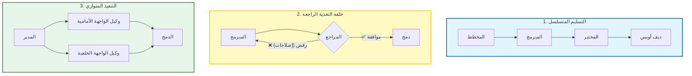

# 🤖 الدليل المفقود للتعاون متعدد الوكلاء (Multi-Agent Collaboration) في تطوير البرمجيات

### 🎯 أهداف التعلم
بحلول نهاية هذا الفصل، ستكون قادراً على:
*   تحديد أدوار محددة لفريق تطوير افتراضي بالذكاء الاصطناعي (مثال: المخطط، المبرمج، المراجع).
*   تطبيق أنماط التعاون الجوهرية: **التسليم المتسلسل (Sequential Handoff)**، **حلقات التغذية الراجعة (Feedback Loops)**، و **التنفيذ المتوازي (Parallel Execution)**.
*   تنسيق الوكلاء باستخدام **الحالة المشتركة (Shared State)** والذاكرة لمنع انحراف السياق (Context Drift).
*   إدارة المخاطر المحددة للأنظمة متعددة الوكلاء، بما في ذلك الحلقات اللانهائية، وانفجار تكلفة الرموز (Token cost explosion)، وتعقيد إدارة الحالة.

---

## 1. 🎯 ما هو التعاون متعدد الوكلاء؟

التعاون متعدد الوكلاء هو ممارسة استخدام **عدة وكلاء ذكاء اصطناعي متخصصين** يعملون معاً — مثل فريق من المطورين — لمعالجة مهام برمجية معقدة. بدلاً من مطالبة نموذج لغوي كبير (LLM) عام واحد بـ "بناء تطبيق"، تقوم بتعيين أدوار متميزة لمثيلات (Instances) وكلاء مختلفة. يقومون **بالتواصل، والتفويض، والتكرار** لتقديم نتائج أفضل مما يمكن لوكيل واحد القيام به بمفرده.

فكر في الأمر على أنه بناء فريق التطوير الخاص بك المدعوم بالذكاء الاصطناعي، حيث تكون أنت المدير الهندسي (Engineering Manager).

---

## 2. 🧠 لماذا يهم ذلك

-   **القابلية للتوسع (Scalability)**: تقسيم المهام الكبيرة (مثال: "ترحيل قاعدة البيانات هذه") إلى تدفقات عمل متوازية.
-   **التخصص (Specialization)**: يتم تحسين كل وكيل لمجال محدد (مثال: وكيل الاختبار لديه أوامر نظام وأدوات مختلفة عن وكيل ديف أوبس).
-   **السرعة**: يقلل الوكلاء المتوازون من وقت التنفيذ (Turnaround time) للمهام المعقدة.
-   **الجودة**: يمكن للوكلاء مراجعة وتحسين عمل بعضهم البعض، والتقاط الهلوسات التي قد يفوتها وكيل واحد.

---

## 3. 🧩 أدوار الوكيل الشائعة في فريق البرمجيات

لبناء سرب (Swarm) فعال، تحتاج إلى تحديد توصيفات وظيفية واضحة.

| دور الوكيل | المسؤوليات |
| :--- | :--- |
| **وكيل التخطيط (Planner Agent)** | يقسم متطلبات المنتج إلى مهام، وقصص مستخدم، ومواصفات. |
| **وكيل المعمارية (Architect Agent)** | يصمم معمارية النظام، وواجهات برمجة التطبيقات (APIs)، ونماذج البيانات. |
| **وكيل التكويد (Coder Agent)** | يكتب ويعيد هيكلة الكود بناءً على المواصفات. |
| **وكيل الاختبار (Tester Agent)** | يولد اختبارات الوحدات/التكامل ويتحقق من الحالات الحدية. |
| **وكيل المراجعة (Reviewer Agent)** | يراجع الكود بحثاً عن الأخطاء، والنمط، والأداء (يعمل كـ "ناقد"). |
| **وكيل ديف أوبس (DevOps Agent)** | يبني خطوط أنابيب CI/CD ويقوم بتكوين بيئات النشر. |
| **وكيل التوثيق (Doc Agent)** | يكتب ويحدث التوثيق الفني بناءً على الكود. |
| **وكيل التغذية الراجعة (Feedback Agent)** | يحلل تعليقات المستخدمين وتقارير الأخطاء لاقتراح تحسينات. |

---

## 4. 🔄 أنماط التعاون

كيف يتحدث هؤلاء الوكلاء مع بعضهم البعض؟ إليك الأنماط القياسية الأربعة.

### 📊 تصور تدفقات عمل الوكيل

### الأنماط بالتفصيل

### 🧬 1. التسليم المتسلسل (خط التجميع)
يمرر كل وكيل مخرجاته إلى التالي كمدخلات.
*   **التدفق:** المخطط ← المعماري ← المبرمج ← المختبر ← ديف أوبس
*   **حالة الاستخدام:** بناء ميزة من الصفر حيث تكون الاعتماديات خطية.

### 🔁 2. حلقة التغذية الراجعة (المحسن)
يقوم الوكلاء بمراجعة وتحسين عمل بعضهم البعض حتى يتم استيفاء عتبة الجودة.
*   **التدفق:** المبرمج ← المراجع ← (إذا تم الرفض) المبرمج ← (إذا تمت الموافقة) المختبر
*   **حالة الاستخدام:** كتابة كود عالي الجودة يجب أن يجتاز معايير تنقيح (Linting) أو أمان صارمة.

### ⚙️ 3. التنفيذ المتوازي (Map-Reduce)
يعمل وكلاء متعددون في وقت واحد على أجزاء مختلفة من المشكلة، ويقوم وكيل نهائي بتجميع النتائج.
*   **التدفق:**
    *   الوكيل أ: كتابة الواجهة الأمامية
    *   الوكيل ب: كتابة الواجهة الخلفية
    *   الوكيل ج: كتابة التوثيق
    *   **وكيل الدمج (Merger Agent)**: دمج الكل في طلب سحب (PR).
*   **حالة الاستخدام:** توليد نموذج أولي كامل المكدس (Full-stack) بسرعة.

### 🧠 4. السرب المصحح ذاتياً (المجلس)
يقوم الوكلاء بالتصويت، أو النقد، أو دمج المخرجات للعثور على الحل الأفضل.
*   **التدفق:** ثلاثة وكلاء تكويد يولدون حلولاً ← وكيل المراجعة يختار الأفضل.
*   **حالة الاستخدام:** حل المشكلات الخوارزمية المعقدة حيث قد يفشل نهج واحد.

---

## 5. 🛠️ الأدوات وأطر العمل للأنظمة متعددة الوكلاء

لا تحتاج لبناء هذا من الصفر. استخدم أطر عمل التنسيق (Orchestration frameworks):

| الأداة | الغرض |
| :--- | :--- |
| **LangChain / LangGraph** | تنسيق تدفقات عمل معقدة، متعددة الوكلاء، وذات حالة (Stateful) باستخدام منطق قائم على الرسم البياني (Graph-based). |
| **CrewAI** | تنسيق الوكلاء القائم على الأدوار مع التركيز على "أطقم" (Crews) تعمل معاً. |
| **Microsoft AutoGen** | إطار عمل لتمكين وكلاء المحادثة من حل المهام عبر الحوار. |
| **PromptLayer / LangSmith** | تتبع تاريخ المحادثات بين الوكلاء لأغراض التصحيح (Debugging). |

---

## 6. ⚖️ ضريبة التعقيد: المقايضات والمخاطر

الأنظمة متعددة الوكلاء قوية، لكن إدارتها أصعب بكثير من الأوامر الفردية.

1.  **الحلقات اللانهائية (Infinite Loops):**
    *   *الخطر:* قد يعلق وكيلان (مثل المبرمج والمراجع) في حلقة حيث يرفض أحدهما الكود ويفشل الآخر في إصلاحه، وتستمر العملية إلى الأبد.
    *   *التخفيف:* نفذ "الحد الأقصى لعدد التكرارات" (مثال: بحد أقصى 5 محاولات) قبل التصعيد إلى إنسان.
2.  **انفجار تكلفة الرموز (Token Cost Explosion):**
    *   *الخطر:* تولد محادثة الوكلاء مع الوكلاء كميات هائلة من النص. يمكن لمهمة بسيطة أن تكلف 10 أضعاف تكلفة أمر واحد.
    *   *التخفيف:* استخدم نماذج أرخص/أسرع (مثل GPT-4o-mini, Haiku) للمهام الفرعية البسيطة واحتفظ بالنماذج القوية (GPT-4o, Opus) لأدوار المعماري/المراجع.
3.  **إدارة الحالة وتلوث السياق (Context Pollution):**
    *   *الخطر:* مع تمرير الوكلاء للرسائل، تمتلئ نافذة السياق بضجيج المحادثة. قد يفقد الوكلاء مسار حالة الملف الأصلية.
    *   *التخفيف:* استخدم معمارية **الحالة المشتركة (Shared State)** (مثل مثيل Redis أو ملف JSON) حيث يقرأ/يكتب الوكلاء الكود الحالي، بدلاً من تمرير كتل الكود ذهاباً وإياباً في تاريخ الدردشة.
4.  **صعوبة التصحيح (Debugging Difficulty):**
    *   *الخطر:* عندما يكون الإخراج خاطئاً، من الصعب معرفة *أي* وكيل فشل في السلسلة.
    *   *التخفيف:* سجل كل خطوة من السلسلة بشكل منفصل (القابلية للتتبع - Traceability).

---

## 7. 📏 مقاييس فعالية تعدد الوكلاء

| المقياس | ما يقيسه |
| :--- | :--- |
| **وقت إنجاز المهمة** | سرعة التسليم من النهاية إلى النهاية مقابل البشر فقط أو الوكيل الفردي. |
| **درجة جودة المخرجات** | الدقة، والمقروئية، وأداء الكود النهائي. |
| **معدل اتفاق الوكلاء** | نسبة الوكلاء الذين يتفقون على نفس الحل (في الأسراب). |
| **معدل رفض المراجعة** | نسبة المخرجات التي تم وضع علامة عليها بواسطة وكيل المراجعة (يشير إلى جودة وكيل التكويد). |
| **التكلفة لكل مهمة** | إجمالي تكلفة الرموز لسلسلة الوكلاء بأكملها. |

---

## 8. 🛡️ أفضل الممارسات

-   **حدد أدواراً واضحة**: تجنب التداخل. لا ينبغي للمبرمج محاولة إعادة تصميم المعمارية؛ يجب أن يتبع مواصفات المعماري.
-   **استخدم الذاكرة المشتركة**: اسمح للوكلاء بالوصول إلى سياق مشترك (مثل نظام ملفات أو قاعدة بيانات متجهة Vector DB) بدلاً من تمرير كل شيء في تاريخ الدردشة.
-   **سجل كل شيء**: تتبع الأوامر، والمخرجات، والقرارات من أجل القابلية للتدقيق.
-   **ضع حدوداً**: امنع الوكلاء من إجراء تغييرات لا رجعة فيها (مثل حذف قواعد البيانات) دون موافقة بشرية.
-   **الإنسان في الحلقة**: احتفظ دائماً بمراجع بشري في نهاية السلسلة للقرارات الحرجة.

---

## 9. 🔮 الاتجاه المستقبلي

-   **مصانع البرمجيات المستقلة**: فرق ذكاء اصطناعي تبني، وتختبر، وتنشر التطبيقات من النهاية إلى النهاية بأمر بشري واحد.
-   **أسواق الوكلاء**: وكلاء جاهزون للتشغيل (Plug-and-play) بمهارات متخصصة (مثال: "وكيل تكامل Stripe").
-   **فرق ذاتية التنظيم**: وكلاء يقومون بتعيين الأدوار ديناميكياً بناءً على تعقيد المهمة دون تكوين بشري.
-   **التعاون عبر المجالات**: وكلاء يربطون بين البرمجيات، والتصميم، والتسويق، والمنتج تلقائياً.

---

### 📝 ملخص والخطوات التالية

**النقاط الرئيسية:**
*   تسمح الأنظمة متعددة الوكلاء بـ **التخصص** و **التصحيح الذاتي**.
*   استخدم أنماطاً مثل **التسليم المتسلسل** للمهام البسيطة و **حلقات التغذية الراجعة** للجودة.
*   **إدارة الحالة** أمر بالغ الأهمية؛ يحتاج الوكلاء إلى "مصدر حقيقة" مشترك (ذاكرة) لتجنب الارتباك.
*   احذر من **الحلقات اللانهائية** و **تكاليف الرموز**—يتطلب التنسيق حواجز حماية.

**القادم تالياً:**
لديك فريق من الوكلاء يعملون لأجلك. ولكن هل يستحق الأمر ذلك فعلاً؟ في **الفصل 10: الدليل المفقود للمقاييس والعائد على الاستثمار (ROI)**، سنتعلم كيفية قياس قيمة العمل الحقيقية لتدفقات عمل الذكاء الاصطناعي الخاصة بك.
