# 🤖 The Missing Guide to Multi-Agent Collaboration in Software Development

### 🎯 Learning Objectives
By the end of this chapter, you will be able to:
*   Define specific roles for a virtual AI development team (e.g., Planner, Coder, Reviewer).
*   Implement core collaboration patterns: **Sequential Handoff**, **Feedback Loops**, and **Parallel Execution**.
*   Orchestrate agents using **Shared State** and memory to prevent context drift.
*   Manage the specific risks of multi-agent systems, including infinite loops, token cost explosion, and state management complexity.

---

## 1. 🎯 What Is Multi-Agent Collaboration?

Multi-agent collaboration is the practice of using **multiple specialized AI agents** that work together — like a team of developers — to tackle complex software tasks. Instead of asking one generalist LLM to "build an app," you assign distinct roles to different agent instances. They **communicate, delegate, and iterate** to deliver better results than a single agent could alone.

Think of it as building your own AI-powered dev team, where you are the Engineering Manager.

---

## 2. 🧠 Why It Matters

-   **Scalability**: Break down large tasks (e.g., "migrate this database") into parallel workflows.
-   **Specialization**: Each agent is optimized for a specific domain (e.g., a Tester Agent has different system prompts and tools than a DevOps Agent).
-   **Speed**: Parallel agents reduce turnaround time for complex tasks.
-   **Quality**: Agents can review and refine each other’s work, catching hallucinations that a single agent might miss.

---

## 3. 🧩 Common Agent Roles in a Software Team

To build an effective swarm, you need to define clear job descriptions.

| Agent Role | Responsibilities |
| :--- | :--- |
| **Planner Agent** | Breaks down product requirements into tasks, user stories, and specs. |
| **Architect Agent** | Designs system architecture, APIs, and data models. |
| **Coder Agent** | Writes and refactors code based on specs. |
| **Tester Agent** | Generates unit/integration tests and validates edge cases. |
| **Reviewer Agent** | Reviews code for bugs, style, and performance (acting as the "Critic"). |
| **DevOps Agent** | Builds CI/CD pipelines and configures deployment environments. |
| **Doc Agent** | Writes and updates technical documentation based on the code. |
| **Feedback Agent** | Analyzes user feedback and bug reports to suggest improvements. |

---

## 4. 🔄 Collaboration Patterns

How do these agents talk to each other? Here are the four standard patterns.

### 📊 Visualizing Agent Workflows

```mermaid
graph TD
    subgraph Sequential ["1. Sequential Handoff"]
        A[Planner] --> B[Coder]
        B --> C[Tester]
        C --> D[DevOps]
    end

    subgraph Feedback ["2. Feedback Loop"]
        E[Coder] --> F{Reviewer}
        F -- "❌ Reject (Fixes)" --> E
        F -- "✅ Approve" --> G[Merge]
    end

    subgraph Parallel ["3. Parallel Execution"]
        H[Manager] --> I[Frontend Agent]
        H --> J[Backend Agent]
        I --> K[Merger]
        J --> K
    end

    style Sequential fill:#e1f5fe,stroke:#01579b,stroke-width:2px
    style Feedback fill:#fff9c4,stroke:#fbc02d,stroke-width:2px
    style Parallel fill:#e8f5e9,stroke:#2e7d32,stroke-width:2px
```

### The Patterns in Detail

### 🧬 1. Sequential Handoff (The Assembly Line)
Each agent passes its output to the next as input.
*   **Flow:** Planner → Architect → Coder → Tester → DevOps
*   **Use Case:** Building a feature from scratch where dependencies are linear.

### 🔁 2. Feedback Loop (The Refiner)
Agents review and refine each other’s work until a quality threshold is met.
*   **Flow:** Coder → Reviewer → (if rejected) Coder → (if approved) Tester
*   **Use Case:** Writing high-quality code that must pass strict linting or security standards.

### ⚙️ 3. Parallel Execution (The Map-Reduce)
Multiple agents work simultaneously on different parts of a problem, and a final agent aggregates the results.
*   **Flow:**
    *   Agent A: Write Frontend
    *   Agent B: Write Backend
    *   Agent C: Write Docs
    *   **Merger Agent**: Combine all into a PR.
*   **Use Case:** Generating a full-stack prototype quickly.

### 🧠 4. Self-Correcting Swarm (The Council)
Agents vote, critique, or merge outputs to find the best solution.
*   **Flow:** Three Coder Agents generate solutions → Reviewer Agent selects the best one.
*   **Use Case:** Solving complex algorithmic problems where one approach might fail.

---

## 5. 🛠️ Tools & Frameworks for Multi-Agent Systems

You don't need to build this from scratch. Use orchestration frameworks:

| Tool | Purpose |
| :--- | :--- |
| **LangChain / LangGraph** | Orchestrate complex, stateful multi-agent workflows with graph-based logic. |
| **CrewAI** | Role-based agent orchestration focused on "crews" working together. |
| **Microsoft AutoGen** | Framework for enabling conversational agents to solve tasks via dialogue. |
| **PromptLayer / LangSmith** | Track the history of agent-to-agent conversations for debugging. |

---

## 6. ⚖️ The Complexity Tax: Trade-offs & Risks

Multi-agent systems are powerful, but they are significantly harder to manage than single prompts.

1.  **Infinite Loops:**
    *   *Risk:* Two agents (e.g., Coder and Reviewer) can get stuck in a loop where one rejects the code and the other fails to fix it, running forever.
    *   *Mitigation:* Implement a "Maximum Iteration Count" (e.g., max 5 retries) before escalating to a human.
2.  **Token Cost Explosion:**
    *   *Risk:* Agents talking to agents generates massive amounts of text. A simple task can cost 10x more than a single prompt.
    *   *Mitigation:* Use cheaper/faster models (e.g., GPT-4o-mini, Haiku) for simple sub-tasks and reserve powerful models (GPT-4o, Opus) for the Architect/Reviewer roles.
3.  **State Management & Context Pollution:**
    *   *Risk:* As agents pass messages, the context window fills up with conversational noise. Agents may lose track of the original file state.
    *   *Mitigation:* Use a **Shared State** architecture (e.g., a Redis instance or a JSON file) where agents read/write the current code, rather than passing code blocks back and forth in chat history.
4.  **Debugging Difficulty:**
    *   *Risk:* When the output is wrong, it's hard to know *which* agent failed in the chain.
    *   *Mitigation:* Log every step of the chain separately (Traceability).

---

## 7. 📏 Metrics for Multi-Agent Effectiveness

| Metric | What It Measures |
| :--- | :--- |
| **Task completion time** | Speed of end-to-end delivery vs. human-only or single-agent. |
| **Output quality score** | Accuracy, readability, and performance of the final code. |
| **Agent agreement rate** | % of agents that converge on the same solution (in swarms). |
| **Review rejection rate** | % of outputs flagged by the Reviewer Agent (indicates Coder Agent quality). |
| **Cost per task** | Total token cost for the entire agent chain. |

---

## 8. 🛡️ Best Practices

-   **Define clear roles**: Avoid overlap. A Coder shouldn't try to redesign the architecture; it should follow the Architect's spec.
-   **Use shared memory**: Let agents access a common context (e.g., a file system or vector DB) rather than passing everything in chat history.
-   **Log everything**: Track prompts, outputs, and decisions for auditability.
-   **Set boundaries**: Prevent agents from making irreversible changes (like deleting DBs) without human approval.
-   **Human-in-the-loop**: Always keep a human reviewer at the end of the chain for critical decisions.

---

## 9. 🔮 Future Direction

-   **Autonomous software factories**: AI teams that build, test, and deploy apps end-to-end with a single human prompt.
-   **Agent marketplaces**: Plug-and-play agents with specialized skills (e.g., a "Stripe Integration Agent").
-   **Self-organizing teams**: Agents that dynamically assign roles based on task complexity without human configuration.
-   **Cross-domain collaboration**: Agents that bridge software, design, marketing, and product automatically.

---

### 📝 Summary & Next Steps

**Key Takeaways:**
*   Multi-agent systems allow for **Specialization** and **Self-Correction**.
*   Use patterns like **Sequential Handoff** for simple tasks and **Feedback Loops** for quality.
*   **State Management** is critical; agents need a shared "source of truth" (memory) to avoid confusion.
*   Beware of **Infinite Loops** and **Token Costs**—orchestration requires guardrails.

**Coming Up Next:**
You have a team of agents working for you. But is it actually worth it? In **Chapter 10: The Missing Guide to Metrics & ROI**, we will learn how to measure the real business value of your AI workflows.