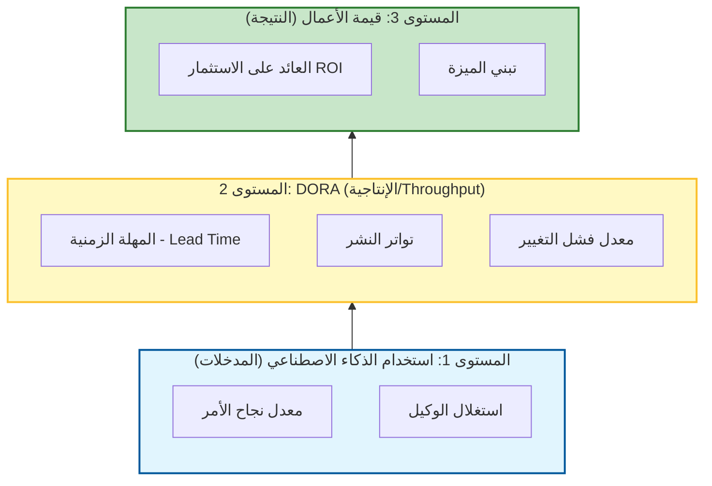

# 📊 الدليل المفقود للمقاييس والعائد على الاستثمار (ROI) في تطوير البرمجيات

### 🎯 أهداف التعلم
بحلول نهاية هذا الفصل، ستكون قادراً على:
*   التمييز بين **مقاييس DORA** التقليدية و **المقاييس الخاصة بالذكاء الاصطناعي** (مثل معدل نجاح الأمر).
*   حساب **العائد على الاستثمار (ROI)** لأدوات الذكاء الاصطناعي الخاصة بك باستخدام صيغة ملموسة خالية من الرياضيات المعقدة.
*   تحديد وتجنب "مقاييس الغرور" (Vanity Metrics) (مثل أسطر الكود) التي يجعلها الذكاء الاصطناعي بالية وخطيرة.
*   التنقل في المقايضات بين البيانات الكمية ومعنويات المطورين (قانون جودهارت - Goodhart's Law).

---

## 1. 🎯 لماذا تهم المقاييس والعائد على الاستثمار

المقاييس والعائد على الاستثمار (ROI) هي الوسيلة التي تقوم من خلالها **بتحديد التقدم كمياً، وتبرير القرارات، وتحسين الأداء**. بدونها، أنت تحلق بلا رؤية (Flying blind). في عصر الذكاء الاصطناعي، حيث تكلف الأدوات المال (لكل مقعد أو لكل رمز/Token) وتعد بمكاسب إنتاجية هائلة، تحتاج إلى إثبات تلك القيمة.

باستخدام المقاييس الصحيحة، يمكنك:
-   تحديد الاختناقات (Bottlenecks) في تدفقات عمل الذكاء الاصطناعي الجديدة.
-   تبرير الاستثمارات (مثال: "لماذا نحتاج إلى 30 دولاراً/شهرياً/للمطور لهذه الأداة؟").
-   مواءمة المخرجات الهندسية مع نتائج الأعمال.
-   تحسين أداء الفريق باستمرار من خلال رصد الأماكن التي يفشل فيها الذكاء الاصطناعي.

### 📊 تصور التسلسل الهرمي للمقاييس

لا يمكنك قياس ROI بشكل مباشر دون قياس الطبقات التأسيسية أولاً.



---

## 2. 🧩 فئات المقاييس

أنت بحاجة إلى بطاقة أداء متوازنة (Balanced scorecard). لا تقم بقياس السرعة فقط؛ قم بقياس الجودة والقيمة.

| الفئة | ما تقيسه | أمثلة |
| :--- | :--- | :--- |
| **التسليم (Delivery)** | السرعة والإنتاجية (Throughput) | المهلة الزمنية (Lead time)، تواتر النشر. |
| **الجودة** | الاستقرار والموثوقية | معدل الأخطاء، تغطية الاختبار، متوسط وقت التعافي (MTTR). |
| **الإنتاجية** | كفاءة المطور | وقت دورة طلب السحب (PR cycle time)، تخبط الكود (Code churn)، تكرار استخدام الذكاء الاصطناعي. |
| **القيمة** | تأثير الأعمال | تبني الميزة، الإيرادات لكل ميزة. |
| **عائد استثمار الذكاء الاصطناعي** | تأثير وكلاء الذكاء الاصطناعي | الوقت الموفر لكل مهمة، معدل نجاح الأمر. |

---

## 3. 🚀 المقاييس الجوهرية التي يجب على كل فريق تتبعها

قبل قياس الذكاء الاصطناعي، تأكد من أنك تتتبع الأساسيات (مقاييس DORA). يجب أن يحرك الذكاء الاصطناعي هذه المؤشرات:

### 🕒 المهلة الزمنية للتغييرات (Lead Time for Changes)
-   **التعريف:** الوقت من التزام الكود (Code commit) إلى الإنتاج.
-   **تأثير الذكاء الاصطناعي:** يجب أن **ينخفض** حيث يسرع الذكاء الاصطناعي التكويد والاختبار.

### 🚀 تواتر النشر (Deployment Frequency)
-   **التعريف:** كم مرة تقوم بالإصدار (Release) إلى الإنتاج.
-   **تأثير الذكاء الاصطناعي:** يجب أن **يزداد** حيث يؤتمت الذكاء الاصطناعي خطوط أنابيب CI/CD.

### 🐞 معدل فشل التغيير (Change Failure Rate)
-   **التعريف:** نسبة عمليات النشر التي تسبب حوادث.
-   **تأثير الذكاء الاصطناعي:** راقب هذا عن كثب. إذا كتب الذكاء الاصطناعي كوداً مليئاً بالأخطاء (Buggy)، فسوف **يرتفع** هذا المعدل.

### 🔧 متوسط وقت التعافي (MTTR)
-   **التعريف:** الوقت لإصلاح مشكلة في الإنتاج.
-   **تأثير الذكاء الاصطناعي:** يجب أن **ينخفض** حيث يساعد الذكاء الاصطناعي في تشخيص السجلات واقتراح الإصلاحات.

### 📈 معدل تبني الميزة (Feature Adoption Rate)
-   **التعريف:** نسبة المستخدمين الذين يتفاعلون مع ميزة جديدة.
-   **تأثير الذكاء الاصطناعي:** يقيس التأثير في العالم الحقيقي، مما يضمن أنك لا تقوم فقط بشحن "برمجيات مهملة" (Shelfware) بشكل أسرع.

---

## 4. 🤖 مقاييس ROI الخاصة بالذكاء الاصطناعي

لفهم ما إذا كان وكلاء الذكاء الاصطناعي يعملون، تتبع هذه المؤشرات المحددة:

| المقياس | ما يخبرك به |
| :--- | :--- |
| **معدل نجاح الأمر** | نسبة الأوامر التي تنتج مخرجات قابلة للاستخدام من المحاولة الأولى. معدل منخفض = هندسة أوامر سيئة. |
| **الوقت الموفر لكل مهمة** | الدقائق/الساعات الموفرة باستخدام الذكاء الاصطناعي مقابل خط الأساس اليدوي (يتطلب تقديراً). |
| **معدل رفض المراجعة** | نسبة الكود المولد بواسطة الذكاء الاصطناعي الذي يفشل في المراجعة البشرية. معدل مرتفع = ثقة منخفضة. |
| **دلتا تغطية الاختبار** | الزيادة في تغطية الاختبار المنسوبة للاختبارات المولدة بواسطة الذكاء الاصطناعي. |
| **استغلال الوكيل** | تكرار استخدام الوكيل عبر تدفقات العمل. هل يستخدم المطورون الأدوات التي اشتريتها بالفعل؟ |

---

## 5. 📏 كيفية قياس ROI

تحتاج إلى صيغة لتبرير تكلفة أدوات الذكاء الاصطناعي للقيادة.

### 🧮 صيغة ROI (بسيطة)

```text
ROI (%) = ((القيمة المكتسبة - التكلفة المتكبدة) / التكلفة المتكبدة) * 100
```

### 🧠 مثال: حساب ROI لوكيل الذكاء الاصطناعي

لنحسب ROI لمطور واحد يستخدم مساعد تكويد.

*   **الافتراضات:**
    *   تكلفة المطور: **50 دولاراً/ساعة**
    *   تكلفة أداة الذكاء الاصطناعي: **200 دولار/شهر** (تشمل المقعد + استخدام الرموز)
    *   الوقت الموفر: **40 ساعة/شهر** (مثال: كتابة كود نمطي، اختبارات، وثائق)

*   **الحساب:**
    1.  **القيمة المكتسبة:** 40 ساعة * 50 دولاراً/ساعة = **2,000 دولار**
    2.  **التكلفة المتكبدة:** **200 دولار**
    3.  **صافي الربح:** 2,000 دولار - 200 دولار = **1,800 دولار**
    4.  **العائد على الاستثمار (ROI):** (1,800 دولار / 200 دولار) * 100 = **900%**

*   **الحكم:** الأداة تغطي تكلفتها في 4 ساعات.

---

## 6. ⚖️ فخ القياس: المقايضات والمخاطر

يمكن أن تكون المقاييس خطيرة إذا أسيء استخدامها. في عصر الذكاء الاصطناعي، تكون مخاطر "التلاعب بالنظام" (Gaming the system) أعلى.

1.  **قانون جودهارت (Goodhart's Law):** "عندما يصبح المقياس هدفاً، فإنه يتوقف عن كونه مقياساً جيداً."
    *   *الخطر:* إذا استهدفت "استخدام الذكاء الاصطناعي"، فقد يقوم المطورون بإغراق الذكاء الاصطناعي بالطلبات فقط لتحقيق الأرقام.
    *   *التخفيف:* قم بقياس النتائج (شحن الميزات)، وليس المخرجات (استخدام الأدوات).
2.  **مغالطة "أسطر الكود" (Lines of Code - LOC):**
    *   *الخطر:* يمكن للذكاء الاصطناعي توليد آلاف الأسطر من الكود في ثوانٍ. قياس الإنتاجية بـ "أسطر الكود" (LOC) أصبح الآن بلا معنى تماماً ويشجع على التضخم (Bloat).
    *   *التخفيف:* **توقف عن استخدام LOC.** ركز على "الميزات التي تم شحنها" أو "نقاط القصة المكتملة" (Story Points).
3.  **المعنويات والمراقبة:**
    *   *الخطر:* تتبع "الوقت الموفر" بقوة شديدة يمكن أن يبدو وكأنه مراقبة، مما يجعل المطورين يشعرون بأنه يتم استبدالهم.
    *   *التخفيف:* قم بتجميع المقاييس على **مستوى الفريق**، وليس المستوى الفردي أبداً. استخدم المقاييس لتحسين النظام، وليس للحكم على الشخص.

---

## 7. 🛠️ أدوات لتتبع المقاييس

| نوع الأداة | أمثلة |
| :--- | :--- |
| **تحليلات التطوير** | Linear, Jira, GitHub Insights, Velocity (Code Climate) |
| **مقاييس CI/CD** | GitHub Actions, CircleCI, Datadog |
| **مراقبة الأخطاء** | Sentry, New Relic, Honeycomb |
| **استخدام الذكاء الاصطناعي** | PromptLayer, LangSmith, برمجيات وسيطة للتسجيل المخصص (Custom logging middleware) |
| **تحليلات المنتج** | Mixpanel, Amplitude, PostHog |

---

## 8. 🛡️ أفضل الممارسات

-   **ابدأ صغيراً**: تتبع 3–5 مقاييس رئيسية (مثال: DORA + معدل نجاح الأمر) بدلاً من لوحة معلومات ضخمة.
-   **أتمت الجمع**: استخدم أدوات CI/CD والتحليلات لتقليل جهد التتبع اليدوي.
-   **تخيل الاتجاهات (Visualize trends)**: استخدم لوحات المعلومات لاكتشاف الأنماط (مثال: "لماذا ارتفع معدل فشل التغيير لدينا بعد تقديم الوكيل X؟").
-   **راجع بانتظام**: اجعل المقاييس جزءاً من مراجعات السباق (Sprint reviews) والاستعراضات بأثر رجعي.
-   **اربط بالنتائج**: اربط دائماً المقاييس الهندسية بقيمة الأعمال (الإيرادات، الاحتفاظ).

---

## 9. 🔮 الاتجاه المستقبلي

-   **لوحات معلومات أصيلة في الذكاء الاصطناعي**: رؤى في الوقت الفعلي مستمدة من سجلات الأوامر، وأداء الوكيل، وجودة الكود تلقائياً.
-   **المقاييس التنبؤية**: ذكاء اصطناعي يتنبأ بمخاطر التسليم، أو الإرهاق (Burnout)، أو تراكم الديون التقنية بناءً على الاتجاهات الحالية.
-   **وكلاء واعون بـ ROI**: وكلاء ذكاء اصطناعي يبلغون ذاتياً عن تأثيرهم ("لقد وفرت عليك 15 دقيقة في هذه المهمة") ويقترحون تحسينات.
-   **مقاييس متعددة الوظائف**: وجهات نظر موحدة عبر المنتج، والتصميم، والهندسة لقياس تدفق تيار القيمة الكلي.

---

### 📝 ملخص والخطوات التالية

**النقاط الرئيسية:**
*   من السهل إثبات **ROI** إذا قمت بتتبع الوقت الموفر مقابل تكلفة الأداة.
*   تظل **مقاييس DORA** هي المعيار الذهبي، ولكن يجب عليك إضافة **مقاييس خاصة بالذكاء الاصطناعي** مثل معدل نجاح الأمر.
*   **تحذير:** لا تقم أبداً بقياس "أسطر الكود" في عالم الذكاء الاصطناعي؛ فهذا يحفز على التضخم البرمجي.

**القادم تالياً:**
يمكنك قياس نجاحك اليوم، ولكن هل سينجو تدفق عملك غداً؟ في **الفصل 11: الدليل المفقود لتجهيز تدفقات عمل الذكاء الاصطناعي للمستقبل**، سنتعلم كيفية بناء أنظمة تتكيف مع التطور السريع لنماذج الذكاء الاصطناعي.
