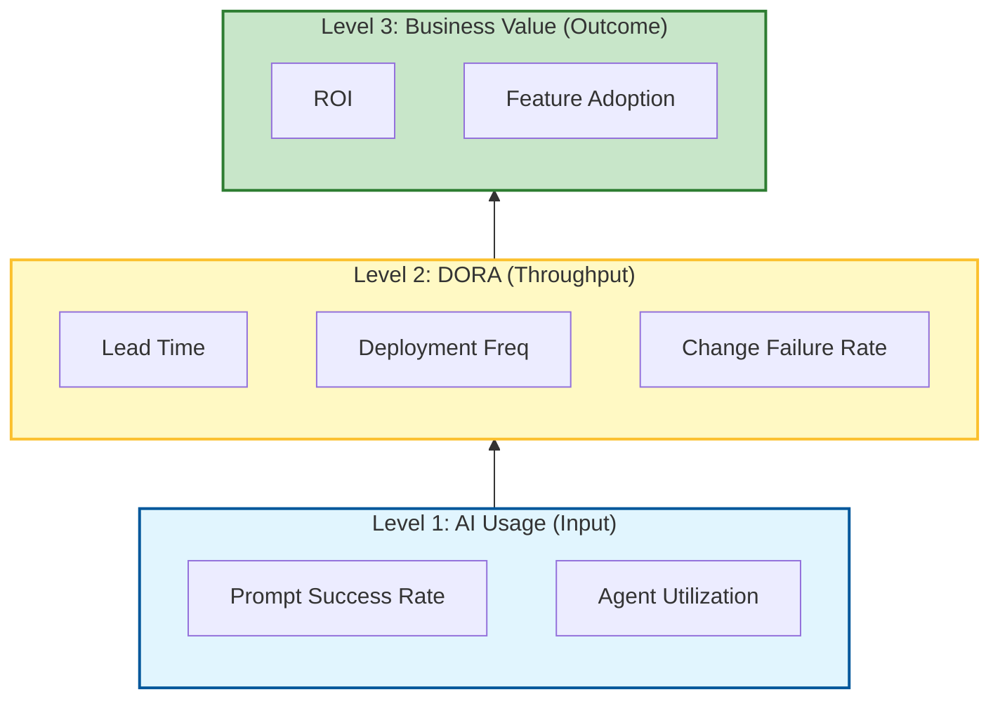

# 📊 The Missing Guide to Metrics & ROI in Software Development

### 🎯 Learning Objectives
By the end of this chapter, you will be able to:
*   Distinguish between traditional **DORA metrics** and **AI-specific metrics** (e.g., Prompt Success Rate).
*   Calculate the **Return on Investment (ROI)** of your AI tools using a concrete, math-free formula.
*   Identify and avoid "Vanity Metrics" (like Lines of Code) that AI renders obsolete and dangerous.
*   Navigate the trade-offs between quantitative data and developer morale (Goodhart's Law).

---

## 1. 🎯 Why Metrics & ROI Matter

Metrics and ROI (Return on Investment) are how you **quantify progress, justify decisions, and optimize performance**. Without them, you’re flying blind. In the AI era, where tools cost money (per seat or per token) and promise massive productivity gains, you need to prove that value.

With the right metrics, you can:
-   Identify bottlenecks in your new AI workflows.
-   Justify investments (e.g., "Why do we need $30/month/dev for this tool?").
-   Align engineering output with business outcomes.
-   Continuously improve team performance by spotting where AI fails.

### 📊 Visualizing the Metrics Hierarchy

You cannot measure ROI directly without measuring the foundational layers first.



---

## 2. 🧩 Categories of Metrics

You need a balanced scorecard. Don't just measure speed; measure quality and value.

| Category | What It Measures | Examples |
| :--- | :--- | :--- |
| **Delivery** | Speed and throughput | Lead time, deployment frequency. |
| **Quality** | Stability and reliability | Bug rate, test coverage, Mean Time to Recovery (MTTR). |
| **Productivity** | Developer efficiency | PR cycle time, code churn, AI usage frequency. |
| **Value** | Business impact | Feature adoption, revenue per feature. |
| **AI ROI** | Impact of AI agents | Time saved per task, prompt success rate. |

---

## 3. 🚀 Core Metrics Every Team Should Track

Before measuring AI, ensure you are tracking the fundamentals (DORA metrics). AI should move these needles:

### 🕒 Lead Time for Changes
-   **Definition:** Time from code commit to production.
-   **AI Impact:** Should **decrease** as AI speeds up coding and testing.

### 🚀 Deployment Frequency
-   **Definition:** How often you release to production.
-   **AI Impact:** Should **increase** as AI automates CI/CD pipelines.

### 🐞 Change Failure Rate
-   **Definition:** % of deployments that cause incidents.
-   **AI Impact:** Watch this closely. If AI writes buggy code, this will **spike**.

### 🔧 Mean Time to Recovery (MTTR)
-   **Definition:** Time to fix a production issue.
-   **AI Impact:** Should **decrease** as AI helps diagnose logs and suggest fixes.

### 📈 Feature Adoption Rate
-   **Definition:** % of users engaging with a new feature.
-   **AI Impact:** Measures real-world impact, ensuring you aren't just shipping "shelfware" faster.

---

## 4. 🤖 AI-Specific ROI Metrics

To understand if your AI agents are working, track these specific indicators:

| Metric | What It Tells You |
| :--- | :--- |
| **Prompt Success Rate** | % of prompts that yield usable output on the first try. Low rate = poor prompt engineering. |
| **Time Saved per Task** | Minutes/hours saved using AI vs. manual baseline (requires estimation). |
| **Review Rejection Rate** | % of AI-generated code that fails human review. High rate = low trust. |
| **Test Coverage Delta** | Increase in test coverage attributable to AI-generated tests. |
| **Agent Utilization** | Frequency of agent use across workflows. Are devs actually using the tools you bought? |

---

## 5. 📏 How to Measure ROI

You need a formula to justify the cost of AI tools to leadership.

### 🧮 ROI Formula (Simple)

```text
ROI (%) = ((Value Gained - Cost Incurred) / Cost Incurred) * 100
```

### 🧠 Example: AI Agent ROI Calculation

Let's calculate the ROI for a single developer using a coding assistant.

*   **Assumptions:**
    *   Developer cost: **$50/hour**
    *   AI Tool cost: **$200/month** (includes seat + token usage)
    *   Time saved: **40 hours/month** (e.g., writing boilerplate, tests, docs)

*   **Calculation:**
    1.  **Value Gained:** 40 hours * $50/hour = **$2,000**
    2.  **Cost Incurred:** **$200**
    3.  **Net Profit:** $2,000 - $200 = **$1,800**
    4.  **ROI:** ($1,800 / $200) * 100 = **900%**

*   **Verdict:** The tool pays for itself in 4 hours.

---

## 6. ⚖️ The Measurement Trap: Trade-offs & Risks

Metrics can be dangerous if misused. In the AI era, the risks of "gaming the system" are higher.

1.  **Goodhart's Law:** "When a measure becomes a target, it ceases to be a good measure."
    *   *Risk:* If you target "AI Usage," devs might spam the AI just to hit numbers.
    *   *Mitigation:* Measure outcomes (shipping features), not outputs (using tools).
2.  **The "Lines of Code" Fallacy:**
    *   *Risk:* AI can generate thousands of lines of code in seconds. Measuring productivity by "Lines of Code" (LOC) is now completely meaningless and encourages bloat.
    *   *Mitigation:* **Stop using LOC.** Focus on "Features Shipped" or "Story Points Completed."
3.  **Morale & Surveillance:**
    *   *Risk:* Tracking "Time Saved" too aggressively can feel like surveillance, making devs feel they are being replaced.
    *   *Mitigation:* Aggregate metrics at the **team level**, never the individual level. Use metrics to improve the system, not judge the person.

---

## 7. 🛠️ Tools for Tracking Metrics

| Tool Type | Examples |
| :--- | :--- |
| **Dev Analytics** | Linear, Jira, GitHub Insights, Velocity (Code Climate) |
| **CI/CD Metrics** | GitHub Actions, CircleCI, Datadog |
| **Error Monitoring** | Sentry, New Relic, Honeycomb |
| **AI Usage** | PromptLayer, LangSmith, custom logging middleware |
| **Product Analytics** | Mixpanel, Amplitude, PostHog |

---

## 8. 🛡️ Best Practices

-   **Start small**: Track 3–5 key metrics (e.g., DORA + Prompt Success Rate) rather than a massive dashboard.
-   **Automate collection**: Use CI/CD and analytics tools to reduce manual tracking effort.
-   **Visualize trends**: Use dashboards to spot patterns (e.g., "Why did our Change Failure Rate spike after introducing Agent X?").
-   **Review regularly**: Make metrics part of sprint reviews and retrospectives.
-   **Tie to outcomes**: Always connect engineering metrics to business value (revenue, retention).

---

## 9. 🔮 Future Direction

-   **AI-native dashboards**: Real-time insights derived from prompt logs, agent performance, and code quality automatically.
-   **Predictive metrics**: AI that forecasts delivery risk, burnout, or tech debt accumulation based on current trends.
-   **ROI-aware agents**: AI agents that self-report their impact ("I saved you 15 minutes on this task") and suggest improvements.
-   **Cross-functional metrics**: Unified views across product, design, and engineering to measure total value stream flow.

---

### 📝 Summary & Next Steps

**Key Takeaways:**
*   **ROI** is easy to prove if you track time saved vs. tool cost.
*   **DORA metrics** remain the gold standard, but you must add **AI-specific metrics** like Prompt Success Rate.
*   **Warning:** Never measure "Lines of Code" in an AI world; it incentivizes bloat.

**Coming Up Next:**
You can measure your success today, but will your workflow survive tomorrow? In **Chapter 11: The Missing Guide to Future-Proofing AI Workflows**, we will learn how to build systems that adapt to the rapid evolution of AI models.