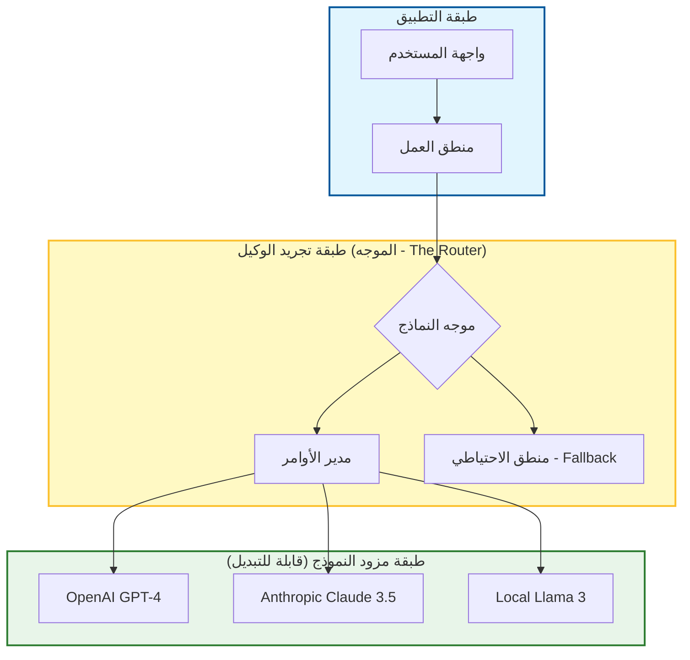

# 🔮 الدليل المفقود لتجهيز تدفقات عمل الذكاء الاصطناعي للمستقبل (Future-Proofing) في تطوير البرمجيات

### 🎯 أهداف التعلم
بحلول نهاية هذا الفصل، ستكون قادراً على:
*   تصميم معماريات ذكاء اصطناعي مرنة (Resilient) في مواجهة التقادم السريع للنماذج ("تقلب النماذج" أو Model Churn).
*   تطبيق منهجية **"الأمر ككود" (Prompt as Code)** للتحكم في إصدارات منطق الذكاء الاصطناعي الخاص بك.
*   تطبيق نمط **طبقة تجريد الوكيل (Agent Abstraction Layer)** لتبديل النماذج اللغوية الكبيرة (LLMs) الأساسية دون كسر تدفقات العمل.
*   التنقل في المقايضة بين **الحياد تجاه الموردين (Vendor Neutrality)** والوصول إلى ميزات النماذج الاحتكارية والمتطورة.

---

## 1. 🎯 ماذا يعني "التجهيز للمستقبل"؟

في عالم الذكاء الاصطناعي، يتغير "أحدث ما توصل إليه العلم" (State of the art) كل بضعة أسابيع. تدفق العمل الذي تم بناؤه على GPT-3.5 في عام 2023 يعتبر قديماً اليوم. التجهيز للمستقبل يعني تصميم تدفقات عمل الذكاء الاصطناعي الخاصة بك بحيث تظل:

-   **قابلة للتكيف (Adaptable)** مع الأدوات والنماذج وأطر العمل الجديدة دون إعادة كتابة كاملة.
-   **مرنة (Resilient)** في مواجهة التغيير، والتوسع، وفشل واجهات برمجة التطبيقات (API failures).
-   **مستدامة (Sustainable)** للاستخدام طويل الأمد عبر الفرق والمشاريع المتطورة.

الأمر يتعلق **ببناء الذكاء الاصطناعي في عملية التطوير الخاصة بك كبنية تحتية**، وليس مجرد اختراق إنتاجي لمرة واحدة.

### 📊 تصور المكدس المضاد للهشاشة (Anti-Fragile Stack)

للبقاء على قيد الحياة في مواجهة تقلب النماذج، يجب عليك فصل منطق عملك (Business logic) عن مزود الذكاء الاصطناعي المحدد.

---

## 2. 🧩 الركائز الجوهرية لتدفقات عمل الذكاء الاصطناعي المجهزة للمستقبل

| الركيزة | ما تضمنه |
| :--- | :--- |
| **النمطية (Modularity)** | يمكنك تبديل الوكلاء، أو الأوامر، أو الأدوات دون كسر النظام. |
| **القابلية للمراقبة (Observability)** | يمكنك تتبع، وتصحيح، وتحسين سلوك الذكاء الاصطناعي بمرور الوقت. |
| **إدارة الإصدارات (Versioning)** | يمكنك تتبع التغييرات في الأوامر، والسياق، والمخرجات (Git للذكاء الاصطناعي). |
| **الحوكمة (Governance)** | يمكنك فرض الاستخدام الأخلاقي، والآمن، والمتوافق حتى مع تغير الأدوات. |
| **القابلية للتوسع (Scalability)** | يمكنك توسيع نطاق استخدام الذكاء الاصطناعي عبر الفرق والمشاريع دون الوصول إلى حدود المعدل (Rate limits) أو جدران التكلفة. |

---

## 3. 🛠️ مكونات تدفق عمل ذكاء اصطناعي مجهز للمستقبل

للبقاء على قيد الحياة في دورة الضجيج (Hype cycle)، تحتاج إلى مكدس مستقر:

### 🧠 مكتبات الأوامر والسياق
-   تخزين أوامر وقوالب سياق قابلة لإعادة الاستخدام ومُدارة الإصدارات.
-   الوسم حسب حالة الاستخدام: `#React`, `#CI/CD`, `#Testing`, `#Debugging`.
-   *لماذا:* إذا قمت بتضمين الأوامر بشكل ثابت (Hardcode) في نصوصك البرمجية، فسيتعين عليك إعادة هيكلة الكود لتغيير سلوك الذكاء الاصطناعي.

### 🔁 حلقات التغذية الراجعة والتقييم
-   سجل كل أمر + مخرج + تقييم بشري.
-   استخدم هذه البيانات لتحسين الأوامر وتحسين أداء الوكيل.
-   *لماذا:* البيانات هي الأصل الوحيد الذي تزيد قيمته بمرور الوقت.

### 📦 طبقة تجريد الوكيل
-   استخدم أطر عمل التنسيق (مثل LangChain, CrewAI) أو أغلفة (Wrappers) داخلية لإدارة الوكلاء.
-   عرف الأدوار (مبرمج، مختبر، مراجع) كوحدات نمطية قابلة للتبديل.
-   *لماذا:* اليوم تستخدم OpenAI؛ غداً قد تستخدم Anthropic أو نموذج Llama محلي. لا تقيد منطق عملك بواجهة برمجة تطبيقات لمورد واحد.

### 📊 المقاييس والمراقبة
-   تتبع معدل نجاح الأمر، والوقت الموفر، ومعدل الأخطاء، ودلتا تغطية الاختبار.
-   استخدم لوحات المعلومات لتصور الاتجاهات والانحدارات.

### 🔐 سياسات وضوابط الوصول
-   حدد من يمكنه استخدام أي وكلاء وأوامر.
-   افرض سياسات خصوصية البيانات والاستخدام الأخلاقي مركزياً.

---

## 4. 🔄 استراتيجيات الترقية

المشهد يتغير بسرعة. إليك كيفية التعامل مع تغييرات محددة:

| ما الذي يتغير | كيفية التكيف |
| :--- | :--- |
| **نماذج ذكاء اصطناعي جديدة** | قم بتجريد استدعاءات النماذج خلف واجهات (Interfaces)؛ اختبر النماذج الجديدة بالتوازي (اختبار A/B) قبل التبديل. |
| **تحولات الأدوات** | استخدم محولات (Adapters) لبيئات التطوير (IDEs)، و CI/CD، وواجهات برمجة التطبيقات. تجنب الاقتران العميق بميزات النظام البيئي الاحتكارية إن أمكن. |
| **نمو الفريق** | أنشئ أدلة تأهيل (Onboarding guides) لتدفقات عمل الذكاء الاصطناعي. وحد مكتبات الأوامر حتى لا يعيد الموظفون الجدد اختراع العجلة. |
| **معايير الأمان** | تدقيقات منتظمة للأوامر، والسجلات، وتدفقات البيانات. تعامل مع مدخلات/مخرجات الذكاء الاصطناعي كبيانات غير موثوق بها. |
| **أولويات العمل** | واءم مكتبات الأوامر وأدوار الوكلاء مع الأهداف المتطورة (مثال: تحويل التركيز من "السرعة" إلى "الأمان"). |

---

## 5. 🧬 أنماط لتدفقات عمل ذكاء اصطناعي مرنة

### 🧱 1. "الأمر ككود" (Prompt as Code)
-   خزن الأوامر في ملفات مُدارة الإصدارات (مثل `.prompt` أو `.yaml`).
-   استخدم التعليقات، والبيانات الوصفية (Metadata)، والاختبارات لكل أمر.
-   عامل تحديث الأمر تماماً مثل التزام الكود (Code commit): راجعه، واختبره، وادمجه.

### 🔁 2. التكامل المستمر للأوامر (CPI)
-   اختبر الأوامر مثل الكود: قم بتشغيلها مقابل مدخلات معروفة ومخرجات متوقعة.
-   استخدم خطوط أنابيب CI للتحقق من سلوك الأمر كلما تغير النموذج الأساسي.

### 🧠 3. سرب الوكلاء مع خطط احتياطية (Fallbacks)
-   استخدم وكلاء متعددين لنفس المهمة.
-   إذا فشل النموذج الأساسي أو هلوس (تم اكتشافه عبر التحقق)، فارجع تلقائياً إلى نموذج مختلف أو إشعار بشري.

---

## 6. ⚖️ ضريبة التجريد: المقايضات والمخاطر

التجهيز للمستقبل يعني غالباً إضافة طبقات من التجريد، والتي تأتي مع تكاليف:

1.  **القاسم المشترك الأدنى (Lowest Common Denominator):**
    *   *الخطر:* إذا قمت ببناء غلاف عام لـ "جميع النماذج اللغوية الكبيرة"، فقد تفقد الوصول إلى ميزات محددة وقوية لمزود واحد (مثل استدعاء الدوال المحدد في OpenAI أو التخزين المؤقت لنافذة السياق الضخمة في Anthropic).
    *   *التخفيف:* اسمح بـ "منافذ هروب" (Escape hatches) في طبقة التجريد الخاصة بك لاستخدام ميزات خاصة بالنموذج عند الضرورة.
2.  **عبء الصيانة (Maintenance Overhead):**
    *   *الخطر:* صيانة "طبقة تجريد الوكيل" الخاصة بك هي عمل هندسي مكلف.
    *   *التخفيف:* اعتمد على المعايير مفتوحة المصدر (مثل LangChain أو LiteLLM) بدلاً من بناء الموجه الخاص بك من الصفر.
3.  **الكمون (Latency):**
    *   *الخطر:* كل طبقة من التجريد (الموجهات، المسجلات، الخطط الاحتياطية) تضيف أجزاء من الثانية إلى وقت الاستجابة.
    *   *التخفيف:* راقب ميزانيات الكمون وتجاوز الطبقات للميزات التي تواجه المستخدم في الوقت الفعلي.

---

## 7. 📏 مقاييس التجهيز للمستقبل

| المقياس | لماذا يهم |
| :--- | :--- |
| **معدل انحراف الأمر (Prompt drift rate)** | عدد المرات التي يتدهور فيها أداء الأوامر بسبب تحديثات النموذج. |
| **وقت استبدال الوكيل** | الوقت اللازم لتبديل نموذج جديد أو خلفية وكيل جديدة (يجب أن يكون دقائق، وليس أياماً). |
| **معدل إعادة استخدام المعرفة** | نسبة الأوامر/السياقات المعاد استخدامها عبر المشاريع. |
| **دلتا التسليم بمساعدة الذكاء الاصطناعي** | الوقت الموفر أو الجودة المحسنة عبر الذكاء الاصطناعي بمرور الوقت. |
| **درجة الامتثال للحوكمة** | الالتزام بالسياسات الأخلاقية والأمنية مع تطور المكدس. |

---

## 8. 🛡️ أفضل الممارسات

-   **صمم من أجل التغيير**: افترض أن أدوات الذكاء الاصطناعي الخاصة بك ستتطور — وخطط لذلك.
-   **افصل المنطق عن اللغة**: حافظ على الأوامر (اللغة) منفصلة عن كود التطبيق (المنطق).
-   **سجل كل شيء**: الأوامر، المخرجات، التقييمات، حالات الفشل — كلها تغذي التحسينات المستقبلية.
-   **راجع بانتظام**: دقق في الأوامر، والوكلاء، وتدفقات العمل كما تفعل مع الكود.
-   **درب الفريق**: اجعل محو الأمية في الذكاء الاصطناعي جزءاً من التأهيل ورفع المهارات.

---

## 9. 🔮 الاتجاه المستقبلي

-   **أوامر ذاتية الإصلاح**: ذكاء اصطناعي يعيد كتابة أوامره الخاصة بناءً على التغذية الراجعة للتكيف مع النماذج الجديدة.
-   **أسواق الوكلاء**: وكلاء جاهزون للتشغيل (Plug-and-play) مع إدارة إصدارات واتفاقيات مستوى الخدمة (SLAs).
-   **بيئات تطوير أصيلة في الذكاء الاصطناعي**: بيئات تطوير مبنية حول تعاون الوكلاء، حيث يكون "الملف" مجرد عرض واحد للمشروع.
-   **معايير أوامر عبر المؤسسات**: مكتبات مشتركة وأطر حوكمة عبر الصناعة.

---

### 📝 ملخص والخطوات التالية

**النقاط الرئيسية:**
*   **الأمر ككود:** قم بإدارة إصدارات ذكائك.
*   **التجريد:** لا تقم بتضمين `openai.completion()` بشكل ثابت؛ استخدم غلافاً للبقاء على قيد الحياة في مواجهة تغييرات الموردين.
*   **القابلية للمراقبة:** لا يمكنك تحسين ما لا يمكنك رؤيته. سجل المدخلات والمخرجات.

**القادم تالياً:**
لقد غطينا الأدوات، وتدفقات العمل، والاستراتيجية. الآن، دعنا نلقي نظرة على العنصر البشري. في **الفصل 12: من مطور إلى منسق ذكاء اصطناعي**، سنناقش كيف ستتطور مسيرتك المهنية وحياتك اليومية في هذا العصر الجديد.
