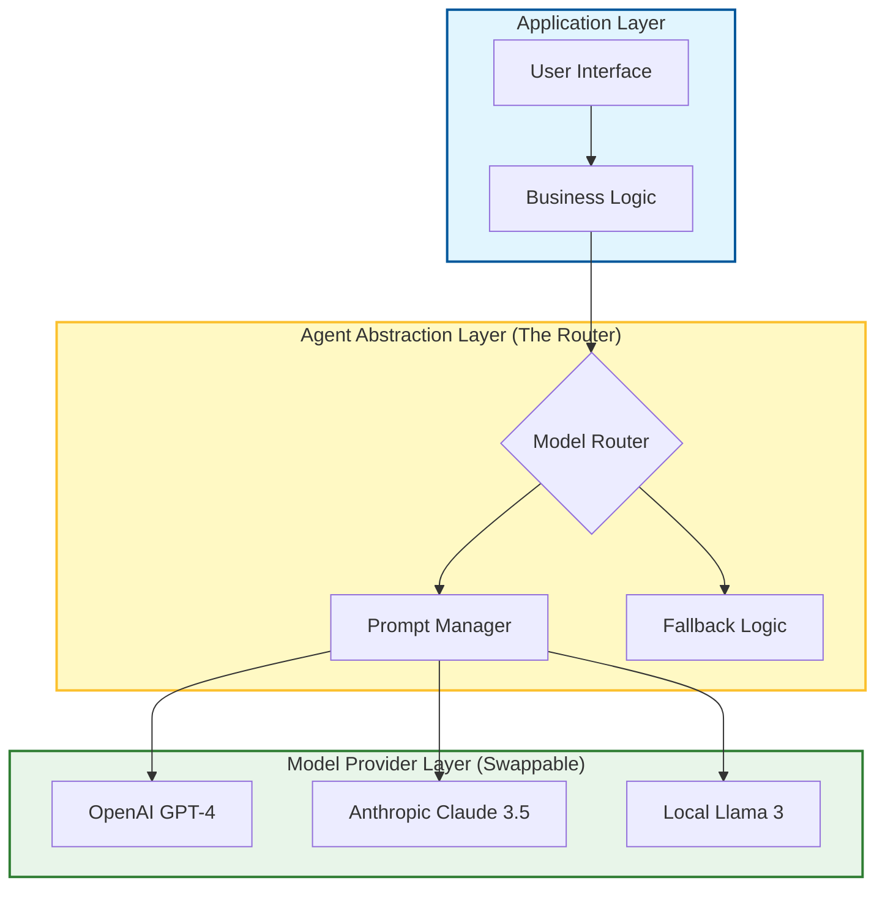

# 🔮 The Missing Guide to Future-Proofing AI Workflows in Software Development

### 🎯 Learning Objectives
By the end of this chapter, you will be able to:
*   Design AI architectures that are resilient to rapid model obsolescence ("Model Churn").
*   Implement the **"Prompt as Code"** methodology to version control your AI logic.
*   Apply the **Agent Abstraction Layer** pattern to swap underlying LLMs without breaking workflows.
*   Navigate the trade-off between **Vendor Neutrality** and accessing proprietary, cutting-edge model features.

---

## 1. 🎯 What Does “Future-Proofing” Mean?

In the world of AI, "state of the art" changes every few weeks. A workflow built on GPT-3.5 in 2023 is obsolete today. Future-proofing means designing your AI workflows so they remain:

-   **Adaptable** to new tools, models, and frameworks without a total rewrite.
-   **Resilient** to change, scale, and API failures.
-   **Sustainable** for long-term use across evolving teams and projects.

It’s about **building AI into your dev process like infrastructure**, not just a one-off productivity hack.

### 📊 Visualizing the Anti-Fragile Stack

To survive model churn, you must decouple your business logic from the specific AI provider.

---

## 2. 🧩 Core Pillars of Future-Proof AI Workflows

| Pillar | What It Ensures |
| :--- | :--- |
| **Modularity** | You can swap agents, prompts, or tools without breaking the system. |
| **Observability** | You can track, debug, and improve AI behavior over time. |
| **Versioning** | You can trace changes in prompts, context, and outputs (Git for AI). |
| **Governance** | You can enforce ethical, secure, and compliant usage even as tools change. |
| **Scalability** | You can scale AI usage across teams and projects without hitting rate limits or cost walls. |

---

## 3. 🛠️ Components of a Future-Proof AI Workflow

To survive the hype cycle, you need a stable stack:

### 🧠 Prompt & Context Libraries
-   Store reusable, versioned prompts and context templates.
-   Tag by use case: `#React`, `#CI/CD`, `#Testing`, `#Debugging`.
-   *Why:* If you hardcode prompts into your scripts, you have to refactor code to change the AI behavior.

### 🔁 Feedback & Evaluation Loops
-   Log every prompt + output + human rating.
-   Use this data to refine prompts and improve agent performance.
-   *Why:* Data is the only asset that appreciates over time.

### 📦 Agent Abstraction Layer
-   Use orchestration frameworks (e.g., LangChain, CrewAI) or internal wrappers to manage agents.
-   Define roles (Coder, Tester, Reviewer) as swappable modules.
-   *Why:* Today you use OpenAI; tomorrow you might use Anthropic or a local Llama model. Don't lock your business logic to one vendor's API.

### 📊 Metrics & Monitoring
-   Track prompt success rate, time saved, bug rate, and test coverage delta.
-   Use dashboards to visualize trends and regressions.

### 🔐 Policy & Access Controls
-   Define who can use which agents and prompts.
-   Enforce data privacy and ethical usage policies centrally.

---

## 4. 🔄 Upgrade Strategies

The landscape shifts fast. Here is how to handle specific changes:

| What’s Changing | How to Adapt |
| :--- | :--- |
| **New AI models** | Abstract model calls behind interfaces; test new models in parallel (A/B testing) before switching. |
| **Tooling shifts** | Use adapters for IDEs, CI/CD, and APIs. Avoid deep coupling with proprietary ecosystem features if possible. |
| **Team growth** | Create onboarding guides for AI workflows. Standardize prompt libraries so new hires don't reinvent the wheel. |
| **Security standards** | Regular audits of prompts, logs, and data flows. Treat AI inputs/outputs as untrusted data. |
| **Business priorities** | Align prompt libraries and agent roles with evolving goals (e.g., shifting focus from "Speed" to "Security"). |

---

## 5. 🧬 Patterns for Resilient AI Workflows

### 🧱 1. “Prompt as Code”
-   Store prompts in version-controlled files (e.g., `.prompt` or `.yaml`).
-   Use comments, metadata, and tests for each prompt.
-   Treat a prompt update exactly like a code commit: Review it, test it, merge it.

### 🔁 2. Continuous Prompt Integration (CPI)
-   Test prompts like code: run them against known inputs and expected outputs.
-   Use CI pipelines to validate prompt behavior whenever the underlying model changes.

### 🧠 3. Agent Swarm with Fallbacks
-   Use multiple agents for the same task.
-   If the primary model fails or hallucinates (detected via validation), automatically fall back to a different model or a human notification.

---

## 6. ⚖️ The Abstraction Tax: Trade-offs & Risks

Future-proofing often means adding layers of abstraction, which comes with costs:

1.  **Lowest Common Denominator:**
    *   *Risk:* If you build a generic wrapper for "All LLMs," you might lose access to specific, powerful features of one provider (e.g., OpenAI's specific Function Calling or Anthropic's huge context window caching).
    *   *Mitigation:* Allow "escape hatches" in your abstraction layer to use model-specific features when necessary.
2.  **Maintenance Overhead:**
    *   *Risk:* Maintaining your own "Agent Abstraction Layer" is expensive engineering work.
    *   *Mitigation:* Lean on open-source standards (like LangChain or LiteLLM) rather than building your own router from scratch.
3.  **Latency:**
    *   *Risk:* Every layer of abstraction (routers, loggers, fallbacks) adds milliseconds to the response time.
    *   *Mitigation:* Monitor latency budgets and bypass layers for real-time, user-facing features.

---

## 7. 📏 Future-Proofing Metrics

| Metric | Why It Matters |
| :--- | :--- |
| **Prompt drift rate** | How often prompts degrade in performance due to model updates. |
| **Agent replacement time** | Time required to swap in a new model or agent backend (should be minutes, not days). |
| **Knowledge reuse rate** | % of prompts/contexts reused across projects. |
| **AI-assisted delivery delta** | Time saved or quality improved via AI over time. |
| **Governance compliance score** | Adherence to ethical and security policies as the stack evolves. |

---

## 8. 🛡️ Best Practices

-   **Design for change**: Assume your AI tools will evolve — and plan for it.
-   **Separate logic from language**: Keep prompts (language) separate from the application code (logic).
-   **Log everything**: Prompts, outputs, ratings, failures — all fuel future improvements.
-   **Review regularly**: Audit prompts, agents, and workflows like you would code.
-   **Train the team**: Make AI literacy part of onboarding and upskilling.

---

## 9. 🔮 Future Direction

-   **Self-healing prompts**: AI that rewrites its own prompts based on feedback to adapt to new models.
-   **Agent marketplaces**: Plug-and-play agents with versioning and SLAs.
-   **AI-native IDEs**: Development environments built around agent collaboration, where the "file" is just one view of the project.
-   **Cross-org prompt standards**: Shared libraries and governance frameworks across the industry.

---

### 📝 Summary & Next Steps

**Key Takeaways:**
*   **Prompt as Code:** Version control your intelligence.
*   **Abstraction:** Don't hardcode `openai.completion()`; use a wrapper to survive vendor changes.
*   **Observability:** You cannot improve what you cannot see. Log inputs and outputs.

**Coming Up Next:**
We have covered the tools, the workflows, and the strategy. Now, let's look at the human element. In **Chapter 12: From Developer to AI Orchestrator**, we will discuss how your personal career and daily life will evolve in this new era.