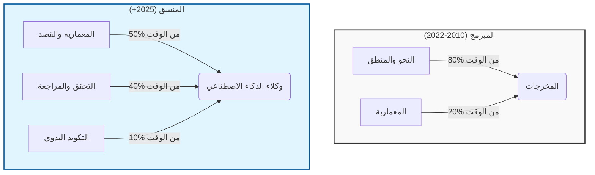

# 🧑‍💻 من مطور إلى منسق ذكاء اصطناعي: تطور الأدوار في عصر الذكاء الاصطناعي

### 🎯 أهداف التعلم
بحلول نهاية هذا الفصل، ستكون قادراً على:
*   تعريف دور **منسق الذكاء الاصطناعي (AI Orchestrator)** وكيف يختلف جوهرياً عن "المبرمج" (Coder) التقليدي.
*   تحديد المهارات الخمس الحاسمة المطلوبة لهذا التحول (مثل هندسة التقييم، وإدارة السياق).
*   هيكلة **فريق متمحور حول الذكاء الاصطناعي (AI-Native Team)** حيث يمتلك البشر والوكلاء أدواراً متميزة ومتكاملة.
*   التنقل في المقايضات المهنية، بما في ذلك خطر **ضمور المهارات (Skill Atrophy)** والتحول النفسي المتمثل في "عدم كتابة الكود".

---

## 1. 🔄 التحول من مبرمج إلى قائد أوركسترا (Conductor)

يشهد دور مطور البرمجيات تحولاً جذرياً. في الماضي، كان يُتوقع من المطورين كتابة كل سطر من الكود، وتصحيح (Debug) كل مشكلة، وإدارة كل عملية نشر يدوياً. ولكن في عصر الذكاء الاصطناعي، لم يعد المطورون الأكثر فاعلية مجرد بنائين—بل أصبحوا **منسقين للذكاء**.

أصبح وكلاء الذكاء الاصطناعي الآن قادرين على توليد الكود، وكتابة الاختبارات، واقتراح المعماريات، وحتى نشر التطبيقات. هذا لا يلغي الحاجة إلى المطورين—بل **يرتقي بدورهم**. بدلاً من التركيز فقط على تفاصيل التنفيذ (النحو البرمجي/Syntax)، يركز المطورون الآن على تصميم النظام والقصد (Intent).

### 📊 تصور تطور الدور

ينقلب تخصيص وقت المطور رأساً على عقب. نحن ننتقل من "القيام بالعمل" إلى "إدارة العمل".

**تدفق العمل الجديد:**
1.  **تصميم تدفقات عمل ذكية** تدمج وكلاء الذكاء الاصطناعي في دورة حياة التطوير.
2.  **هندسة الأوامر والسياق** لتوجيه سلوك الذكاء الاصطناعي.
3.  **تقييم والتحقق من** المخرجات المولدة بواسطة الذكاء الاصطناعي من حيث الصحة، والأمان، والامتثال.
4.  **تنسيق المعرفة (Curate knowledge)** التي يمكن للوكلاء الاستفادة منها للتحسن بمرور الوقت.
5.  **تنسيق وكلاء متعددين** كفريق افتراضي، لكل منهم دور متخصص.

هذا الدور الجديد يتعلق بالكتابة (Typing) بشكل أقل، ويتعلق أكثر **بالتفكير، والتوجيه، والتحسين**.

---

## 2. 🛠️ مهارات جديدة لمنسق الذكاء الاصطناعي

للازدهار في هذا النموذج الجديد، يجب على المطورين تنمية مهارات جديدة. هذه ليست بدائل لأساسيات علوم الكمبيوتر التقليدية—إنها **امتدادات** تجعل المطورين أكثر قوة.

| المهارة | الوصف |
| :--- | :--- |
| **هندسة الأوامر (Prompt Engineering)** | صياغة تعليمات دقيقة وموجهة نحو الهدف. إنها النحو البرمجي (Syntax) الجديد. |
| **إدارة السياق (Context Management)** | تغذية الوكلاء بالمعلومات الصحيحة (RAG) في الوقت المناسب لمنع الهلوسات. |
| **تعاون الوكلاء** | تصميم تدفقات عمل يتفاعل فيها وكلاء متعددون (مبرمج، مختبر) بشكل منتج. |
| **هندسة التقييم (Evaluation Engineering)** | بناء أنظمة مؤتمتة لاختبار، وتسجيل نقاط، والتحقق من مخرجات الذكاء الاصطناعي ("بوابة الجودة"). |
| **الرقابة الأخلاقية** | ضمان توافق استخدام الذكاء الاصطناعي مع معايير الأمان، والإنصاف، والشفافية. |

---

## 3. 👥 صعود الفريق المتمحور حول الذكاء الاصطناعي

في الفريق المتمحور حول الذكاء الاصطناعي، يتم إعادة تعريف الأدوار. الإنسان هو القائد؛ والوكلاء هم الموظفون.

-   يقوم **وكيل التخطيط** بتقسيم أهداف المنتج إلى مهام.
-   يقوم **وكيل التكويد** بتوليد التنفيذ.
-   يقوم **وكيل الاختبار** بكتابة وتشغيل الاختبارات.
-   يقوم **وكيل المراجعة** بالتحقق من الجودة والامتثال.
-   يقوم **وكيل ديف أوبس (DevOps)** بالتعامل مع النشر.

يصبح المطور البشري هو **المنسق**—حيث يصمم النظام، ويوجه الوكلاء، ويحل النزاعات، ويتخذ قرار "الشحن" (Ship It) النهائي.

---

## 4. ⚖️ أزمة الهوية: المقايضات والمخاطر

يأتي الانتقال إلى دور المنسق مع مخاطر نفسية ومهنية يجب إدارتها.

1.  **ضمور المهارات (فقدان "الذاكرة العضلية"):**
    *   *الخطر:* إذا لم تكتب حلقة `for` مرة أخرى، فقد تنسى كيفية عملها. عندما يفشل الذكاء الاصطناعي (وسيفعل)، قد تفتقر إلى المهارات منخفضة المستوى لإصلاحه.
    *   *التخفيف:* مارس أيام "التكويد اليدوي". اقرأ كود الذكاء الاصطناعي سطراً بسطر للحفاظ على الفهم. لا تؤتمت أبداً ما لا تفهمه.
2.  **متلازمة المحتال (Impostor Syndrome):**
    *   *الخطر:* غالباً ما يشعر المطورون بالذنب أو الاحتيال عندما يشحنون كوداً لم يكتبوه بأيديهم. "هل قمت ببناء هذا حقاً؟"
    *   *التخفيف:* حول مقياس قيمتك من "أسطر الكود المكتوبة" إلى "المشكلات التي تم حلها" و "الأنظمة التي تم تصميمها". أنت تتقاضى أجراً مقابل النتيجة، وليس الكتابة.
3.  **فجوة المساءلة:**
    *   *الخطر:* من السهل إلقاء اللوم على الذكاء الاصطناعي في وجود خطأ برمجي. "Copilot هو من كتبه، لست أنا."
    *   *التخفيف:* تبنَّ العقلية التالية: **"الذكاء الاصطناعي هو المطور المبتدئ (Junior)؛ وأنا الخبير (Senior). أنا مسؤول عن كل سطر يتم دمجه."**

---

## 5. 🚀 أن تصبح منسق ذكاء اصطناعي

للدخول في هذا الدور، ابدأ اليوم:

1.  **ابدأ صغيراً**: استخدم الذكاء الاصطناعي للمهام الهامشية مثل توليد الاختبارات أو التوثيق قبل السماح له بكتابة المنطق الأساسي.
2.  **ابنِ مكتبات**: أنشئ أوامر وكتل سياق قابلة لإعادة الاستخدام. تعامل معها كمجموعة أدواتك الشخصية.
3.  **تتبع الأداء**: سجل المخرجات، وسجل نقاط الجودة، وكرر العملية. لا تقبل المسودة الأولى فقط.
4.  **صمم تدفقات العمل**: توقف عن التفكير بمصطلحات "الدوال" وابدأ التفكير بمصطلحات "خطوط الأنابيب" (Pipelines) حيث تتدفق البيانات بين الوكلاء.
5.  **ابق أخلاقياً**: تحكم في استخدام الذكاء الاصطناعي بشفافية وعناية. كن الإنسان في الحلقة.

---

### 📝 ملخص والخطوات التالية

**النقاط الرئيسية:**
*   **المنسقون** يصممون الأنظمة؛ **المبرمجون** يكتبون النحو البرمجي. تتجه الصناعة نحو التنسيق.
*   تحتاج إلى مهارات جديدة: **التقييم**، **إدارة السياق**، و **هندسة الأوامر**.
*   **احذر من الضمور:** يجب عليك الحفاظ على مهارات التكويد التأسيسية الخاصة بك لمراجعة مخرجات الذكاء الاصطناعي بفعالية.

**القادم تالياً:**
لديك العقلية. الآن تحتاج إلى الأدوات. في **الفصل 13: بناء المكدس الجاهز للذكاء الاصطناعي**، سنحدد الأدوات، والقوالب، والبنية التحتية المحددة التي تحتاجها لبناء بيئة تطوير ذكاء اصطناعي بمستوى الإنتاج.
