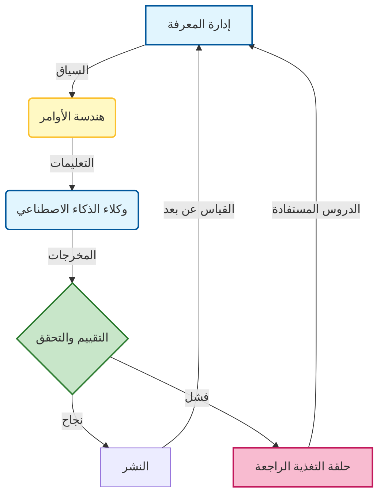

### 🎯 أهداف التعلم
بحلول نهاية هذا الفصل، ستكون قادراً على:
*   توليف الركائز الجوهرية للمنهجية **المتمحورة حول الذكاء الاصطناعي (AI-Native)** (التنسيق، السياق، التحقق).
*   استيعاب التحول في العقلية من "كاتب الكود" إلى "مصمم الأنظمة".
*   توقع التحديات المحددة للعقد القادم، بما في ذلك التوتر بين **الاستقلالية (Autonomy)** و **التحكم (Control)**.
*   الالتزام بمسار التعلم المستمر مع تطور نماذج الذكاء الاصطناعي.

---

## 1. 🔄 نهاية البداية

لن يتم تعريف العقد القادم من تطوير البرمجيات بلغة واحدة، أو إطار عمل، أو منهجية واحدة. سيتم تعريفه من خلال تحول جوهري في كيفية بنائنا: **من اليدوي إلى الذكي، ومن المعزول إلى المنسق، ومن الثابت إلى المتكيف**.

نحن ندخل حقبة **التطوير المتمحور حول الذكاء الاصطناعي (AI-native development)**—عالم لا يكون فيه الوكلاء الأذكياء مجرد أدوات، بل زملاء في الفريق. هم يكتبون الكود، ويولدون الاختبارات، ويراجعون طلبات السحب (Pull requests)، ويديرون عمليات النشر، وحتى يساعدون في تصميم الأنظمة. لكنهم لا يستبدلون المطورين—بل **يضخمون قدراتهم (Amplify)**.

لم يكن هذا الكتاب مجرد دليل لاستخدام Copilot؛ بل كان حول إعادة هيكلة ممارستك الهندسية بالكامل للاستفادة من هذا التضخيم بأمان وفعالية.

### 📊 تصور دولاب الموازنة المتمحور حول الذكاء الاصطناعي (AI-Native Flywheel)

المفاهيم الواردة في هذا الكتاب ليست خطوات معزولة؛ إنها تشكل حلقة تعزيز ذاتي. المعرفة الأفضل تؤدي إلى أوامر أفضل، والتي تؤدي إلى وكلاء أفضل، الذين يولدون بيانات لتحسين المعرفة.

---

## 2. 📚 ما تعلمناه

خلال هذا الكتاب، استكشفنا **الأدلة المفقودة** التي تجسر الهوة بين التطوير التقليدي وتدفقات العمل المعززة بالذكاء الاصطناعي:

-   **الوكلاء (الفصلين 2 و 9):** كيفية نشر وكلاء متخصصين (مبرمج، مختبر، مراجع) وتنسيقهم في أسراب (Swarms).
-   **الهندسة (الفصلين 3 و 4):** كيفية التعامل مع الأوامر والسياق كتخصصات هندسية، وليس كتعاويذ سحرية.
-   **الجودة (الفصلين 5 و 6):** كيفية بناء خطوط أنابيب تقييم صارمة وحلقات تغذية راجعة للثقة فيما تبنيه.
-   **الحوكمة (الفصلين 7 و 8):** كيفية إدارة المعرفة والأخلاقيات لضمان أن أنظمتك آمنة ومتوافقة.
-   **الاستراتيجية (الفصلين 10 و 11):** كيفية قياس العائد على الاستثمار (ROI) وتجهيز مكدسك للمستقبل (Future-Proof) ضد التغيير السريع.

هذه ليست مجرد تكتيكات—إنها أساس لتخصص هندسي جديد.

---

## 3. 🧠 عقلية المطور الجديد

للازدهار في هذه الحقبة الجديدة، يجب أن يتطور المطورون. دور "منسق الذكاء الاصطناعي" هو دور متميز عن "مهندس البرمجيات" لعام 2020:

| من | إلى |
| :--- | :--- |
| **مبرمج** (كتابة النحو البرمجي) | **منسق** (تصميم الأنظمة) |
| **منفذ المهام** (إغلاق التذاكر) | **مصمم تدفق العمل** (بناء خطوط الأنابيب) |
| **مستخدم الأدوات** (IDE) | **مفكر نظامي** (المعمارية) |

يتطلب هذا التحول الفضول، والقدرة على التكيف، والالتزام بالتعلم المستمر. كما يتطلب بوصلة أخلاقية قوية—لأنه مع القوة العظيمة تأتي مسؤولية عظيمة.

---

## 4. ⚖️ العقبات القادمة: المقايضات والمخاطر

بينما نتطلع إلى المستقبل، يجب أن نعترف بأن الذكاء الاصطناعي ليس ترياقاً (Panacea). سيجلب العقد القادم تحديات محددة يجب عليك، كمنسق، تجاوزها:

1.  **مشكلة "الصندوق الأسود":** مع زيادة استقلالية الأنظمة، يصبح التصحيح (Debugging) أصعب. يجب أن تقاتل من أجل **القابلية للمراقبة (Observability)** و **القابلية للتفسير (Explainability)** في كل وكيل تنشره.
2.  **الاعتماد المفرط:** هناك خطر حقيقي يتمثل في فقدان المهارات التأسيسية. إذا توقفت عن كتابة الكود تماماً، ستفقد القدرة على الحكم على مخرجات الذكاء الاصطناعي. يجب أن تحافظ على **"الذاكرة العضلية" (Muscle Memory)** الخاصة بك من خلال الممارسة المتعمدة.
3.  **أرضية الضجيج (The Noise Floor):** يسهل الذكاء الاصطناعي توليد الكود، والاختبارات، والوثائق. كما أنه يسهل توليد *البريد العشوائي (Spam)*. يجب أن تكون حارس بوابة **الجودة**، لضمان ألا يطغى الحجم على القيمة.

---

## 5. 🏗️ التصميم للمستقبل

الفرق الأكثر نجاحاً في العقد القادم ستقوم بـ:

-   معاملة **الأوامر والسياق** كأصول من الدرجة الأولى، تتم إدارة إصداراتها ومراجعتها مثل الكود.
-   بناء تدفقات عمل ذكاء اصطناعي **نمطية، وقابلة للمراقبة، وقابلة للحوكمة** يمكنها تبديل النماذج مع تطور التكنولوجيا.
-   تبني **حلقات التغذية الراجعة** ومشاركة المعرفة لجعل وكلائهم أكثر ذكاءً بمرور الوقت.
-   إعطاء الأولوية **للشفافية، والإنصاف، والأمان** على السرعة الخام.
-   الاستثمار في **الأدوات، والقوالب، وممارسات الفريق** التي تتوسع إلى ما هو أبعد من المطور الفردي.

لن يقوموا ببناء البرمجيات فقط. بل سيبنون **أنظمة تتعلم، وتتكيّف، وتتطور**.

---

## 6. 🚀 دورك في الفصل القادم

سواء كنت مطوراً منفرداً، أو قائد فريق، أو مديراً تقنياً (CTO)، لم يعد دورك يقتصر على كتابة الكود. إنه تصميم أنظمة ذكية، وتوجيه المتعاونين من الذكاء الاصطناعي، وتشكيل مستقبل البرمجيات.

العقد القادم ينتمي لأولئك الذين يستطيعون مزج **الإبداع البشري** مع **ذكاء الآلة**. لديك الدليل التشغيلي (Playbook). لديك القوالب. لديك العقلية.

الآن، اذهب وابنِ المستقبل.

---

### 📝 الاستنتاجات النهائية

**النقاط الرئيسية:**
*   **المتمحور حول الذكاء الاصطناعي (AI-Native)** هو تخصص، وليس مجموعة أدوات. إنه يتطلب الصرامة، والحوكمة، والمعمارية.
*   **التنسيق (Orchestration)** هو المهارة عالية التأثير للمستقبل.
*   **الحكم البشري** يظل حاجز الأمان النهائي. لا تؤتمت أبداً ما لا تفهمه.

**الإجراء النهائي:**
خذ تدفق عمل واحد من هذا الكتاب—سواء كان مكتبة أوامر، أو قالب سياق، أو حلقة تحقق—وقم بتنفيذه في فريقك **هذا الأسبوع**. أفضل طريقة للتنبؤ بالمستقبل هي بناؤه.
