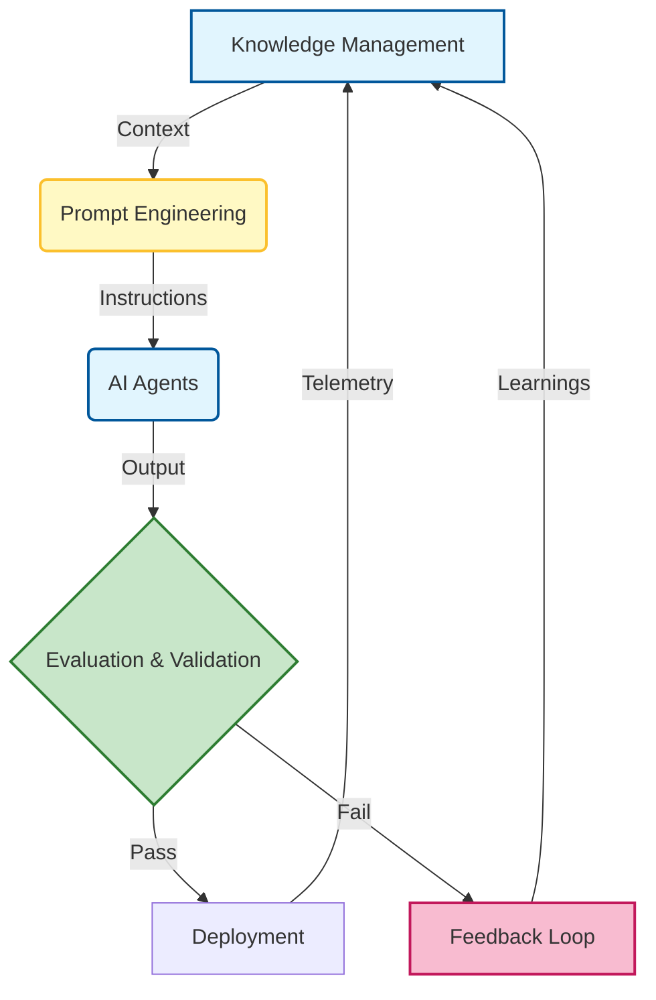

# 🏁 Conclusion: Designing for the Next Decade of Software

### 🎯 Learning Objectives
By the end of this chapter, you will be able to:
*   Synthesize the core pillars of the **AI-Native** methodology (Orchestration, Context, Validation).
*   Internalize the mindset shift from "Code Writer" to "System Designer."
*   Anticipate the specific challenges of the next decade, including the tension between **Autonomy** and **Control**.
*   Commit to a path of continuous learning as AI models evolve.

---

## 1. 🔄 The End of the Beginning

The next decade of software development won’t be defined by a single language, framework, or methodology. It will be defined by a fundamental shift in how we build: **from manual to intelligent, from isolated to orchestrated, from static to adaptive**.

We are entering the era of **AI-native development**—a world where intelligent agents are not just tools, but teammates. They write code, generate tests, review pull requests, manage deployments, and even help design systems. But they don’t replace developers—they **amplify** them.

This book was not just about using Copilot; it was about restructuring your entire engineering practice to leverage this amplification safely and effectively.

### 📊 Visualizing the AI-Native Flywheel

The concepts in this book are not isolated steps; they form a self-reinforcing loop. Better knowledge leads to better prompts, which lead to better agents, which generate data to improve knowledge.

---

## 2. 📚 What We've Learned

Throughout this book, we’ve explored the **missing guides** that bridge the gap between traditional development and AI-augmented workflows:

-   **Agents (Ch 2 & 9):** How to deploy specialized agents (Coder, Tester, Reviewer) and orchestrate them in swarms.
-   **Engineering (Ch 3 & 4):** How to treat Prompts and Context as engineering disciplines, not magic spells.
-   **Quality (Ch 5 & 6):** How to build rigorous Evaluation pipelines and Feedback loops to trust what you build.
-   **Governance (Ch 7 & 8):** How to manage Knowledge and Ethics to ensure your systems are safe and compliant.
-   **Strategy (Ch 10 & 11):** How to measure ROI and Future-Proof your stack against rapid change.

These aren’t just tactics—they’re the foundation of a new engineering discipline.

---

## 3. 🧠 The New Developer Mindset

To thrive in this new era, developers must evolve. The "AI Orchestrator" is a distinct role from the "Software Engineer" of 2020:

| From | To |
| :--- | :--- |
| **Coder** (Typing Syntax) | **Orchestrator** (Designing Systems) |
| **Task Executor** (Closing Tickets) | **Workflow Designer** (Building Pipelines) |
| **Tool User** (IDE) | **System Thinker** (Architecture) |

This shift requires curiosity, adaptability, and a commitment to continuous learning. It also requires a strong ethical compass—because with great power comes great responsibility.

---

## 4. ⚖️ The Roadblocks Ahead: Trade-offs & Risks

As we look to the future, we must acknowledge that AI is not a panacea. The next decade will bring specific challenges that you, as an Orchestrator, must navigate:

1.  **The "Black Box" Problem:** As systems become more autonomous, debugging becomes harder. You must fight for **Observability** and **Explainability** in every agent you deploy.
2.  **Over-Reliance:** There is a real risk of losing foundational skills. If you stop writing code entirely, you lose the ability to judge the AI's output. You must maintain your **"Muscle Memory"** through deliberate practice.
3.  **The Noise Floor:** AI makes it easy to generate code, tests, and docs. It also makes it easy to generate *spam*. You must be the gatekeeper of **Quality**, ensuring that volume does not drown out value.

---

## 5. 🏗️ Designing for the Future

The most successful teams of the next decade will:

-   Treat **prompts and context** as first-class assets, versioned and reviewed like code.
-   Build **modular, observable, and governable** AI workflows that can swap models as technology evolves.
-   Embrace **feedback loops** and knowledge sharing to make their agents smarter over time.
-   Prioritize **transparency, fairness, and security** over raw speed.
-   Invest in **tools, templates, and team practices** that scale beyond the individual developer.

They won’t just build software. They’ll build **systems that learn, adapt, and evolve**.

---

## 6. 🚀 Your Role in the Next Chapter

Whether you’re a solo developer, a team lead, or a CTO, your role is no longer just to write code. It’s to design intelligent systems, guide AI collaborators, and shape the future of software.

The next decade belongs to those who can blend **human creativity** with **machine intelligence**. You have the playbook. You have the templates. You have the mindset.

Now, go build the future.

---

### 📝 Final Takeaways

**Key Takeaways:**
*   **AI-Native** is a discipline, not a toolset. It requires rigor, governance, and architecture.
*   **Orchestration** is the high-leverage skill of the future.
*   **Human Judgment** remains the ultimate safety rail. Never automate what you don't understand.

**Final Action:**
Take one workflow from this book—whether it's a Prompt Library, a Context Template, or a Validation Loop—and implement it in your team **this week**. The best way to predict the future is to build it.